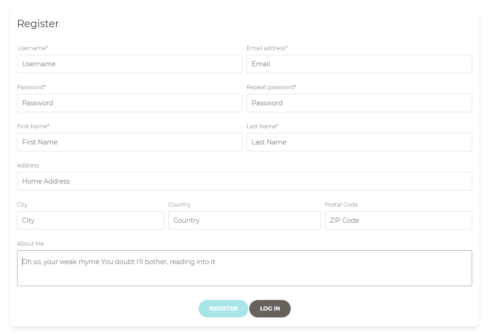

# DeskMart

> **Solución IoT para despachos y escritorios**
> 

> Jorge El Busto e Ibai Guillén
> 

> Ingeniería Informática + TDE
> 

---

# Descripción del proyecto

Deskmart nace de la unión de las palabras "Desktop" y "Smart", y busca otorgar a los usuarios la mejor experiencia posible durante una sesión de trabajo en el escritorio a través de las nuevas tecnologías.

El proyecto Deskmart tiene un *front-end* realmente intuitivo que permite comprobar diferentes aspectos del entorno de trabajo en el que un usuario tiene ubicado el escritorio, como la temperatura de la sala, la humedad, y un mapa de calor con las zonas de la mesa con las que el usuario más ha entrado en contacto. 

Además, en caso de desear obtener más información acerca de la experiencia de los usuarios con el escritorio inteligente Deskmart, cabe la posibilidad de poder acceder al historial de datos que se han ido acumulando durante las diferentes sesiones de trabajo del usuario en cuestión.

---

# Instalación de Deskmart

## Pre-requisitos

Para poder instalar y ejecutar Deskmart, es necesario tener instalados previamente Python y Node.js, para poder poner en funcionamiento el *back-end* y el *front-end*, respectivamente.

### Node.js

1. Ir a la página principal de Node.js.
2. Hacer clic al cuadro de texto que dice "New security releases now available for 15.x, 14.x, 12.x and 10.x release lines", y descargarse la 10.23.1.
3. Descargar el ejecutable.
4. Ejecutarlo y seguir los pasos de instalación.
5. Finalmente reiniciar el ordenador para finalizar la instalación.

[Node.js](https://nodejs.org/es/)

<aside>
ℹ️ Versión 10.23.0 utilizada

</aside>

---

### Python

1. Ir a la página principal de Python.
2. Acceder al apartado de descargas.
3. Descargar el ejecutable de la última versión estable, en este caso la 3.8.0.
4. Ejecutarlo y seguir los pasos de instalación.
5. Es recomendable reiniciar el ordenador para finalizar la instalación.

[Welcome to Python.org](https://www.python.org/)

<aside>
ℹ️ Versión 3.8.0 utilizada

</aside>

---

Vamos a dividir la instalación y ejecución de Deskmart en tres apartados: el *back-end*, y el *front-end y el script de lectura de sensores*. El *back-end* contiene la API, que cuenta con todos los endpoints relacionados con la gestión de usuarios, consulta de datos de los sensores y redireccionamiento de peticiones de OpenWeatherAPI. Por otra parte, el *front-end...* se visualizan todos los datos de la REST API. Y por último el script de la raspberry que se encarga de leer los datos de los sensores, subirlos a influxdb y mostrar en la pantalla LCD la información.

## Back-end

### Instalación

Para la instalación de las dependencias relacionadas al *back-end*, habrá que situarse en la carpeta **Deskmart_Backend_API**, y seguir los próximos dos pasos.

1. Crear un entorno virtual en Python 3. 
2. Instalar las dependencias mediante el comando `pip install -r requirements.txt`

### Ejecución

Para poner el *back-end* en funcionamiento, habrá que abrir la línea de comandos en la misma carpeta en la que nos situábamos anteriormente, y ejecutar el comando `python api.py`. De esta manera, en `[localhost:3000](http://localhost:3000)` se podrán consultar los diferentes endpoints.

## Front-end

### Instalación

Para instalar las dependencias relacionadas con el *front-end*, habrá que situarse en la carpeta **Deskmart_Frontend**, y ejecutar el comando `npm install`, para así instalar todos los módulos de Node.js requeridos para lanzar la aplicación.

### Ejecución

1. `npm run build`
2. `npm start`
3. Entrar al navegador y acceder a `[localhost:5000](http://localhost:5000)` o `192.168.0.X:5000`, siendo X la dirección que equivalga al *localhost*.

<aside>
ℹ️ Si queremos ejecutar la aplicación en un entorno **debug**, hay que ejecutar el comando `npm run deploy` en Node y navegar a `localhost:4200`.

</aside>

## Script Raspberry

### Instalación

1. Crear un entorno virtual en Python 3. 
2. Instalar las dependencias mediante el comando `pip install -r requirements.txt`

### Configuración

Para el correcto funcionamiento de este script hay que configurar los parámetros de los pines de los sensores que están en el fichero config.py, además también hay que poner el correo de la cuenta con la que se va a vincular la mesa.

```python
#User
USERNAME= "jorge.ibai@gmail.com"

#Sensors
FLAME_SENSOR=22
RGB_LCD_SENSOR=2
TEMP_HUM_SENSOR=5
TOUCH_SENSOR_1x1=16
TOUCH_SENSOR_1x2=18
TOUCH_SENSOR_2x1=24
TOUCH_SENSOR_2x2=26
```

### Ejecución

Para poner el script en funcionamiento, habrá que abrir la línea de comandos en la raspberry y ejecutar el comando `python rp.py`. De esta manera, el script empezará a funcionar, se puede crear un ejecutable para automatizar esta tarea con cada boot de la raspberry.

---

# Guía: ¿Cómo utilizar Deskmart?

## Registro

Para empezar, el usuario tendrá que registrarse. El formulario a seguir cuenta con datos muy genéricos, pero el definir correctamente la ciudad será clave, ya que la pantalla principal de Deskmart contará con el tiempo de la ciudad que haya definido el usuario.



## Inicio de sesión

La pantalla de inicio de sesión sigue el método tradicional de cualquier página web, con campos establecidos para el nombre de usuario y contraseña.


<aside>
⚠️ En caso de querer consultar datos que ya se hayan guardado previamente, se puede iniciar sesión con nuestro usuario. El usuario es *jorge.ibai*, y la contraseña es *jorge.ibai*.

</aside>

---

## Pantalla principal

Una vez nos hayamos registrado o hayamos iniciado sesión en Deskmart, tenemos varios valores que pueden actualizarse de manera asíncrona, y vamos a explicar detalladamente en qué consiste cada uno.


Cabe destacar, además, que el color de la interfaz es totalmente personalizable, habilitando un modo oscuro, además de poder cambiar el color de la fuente de los menús.


- **Aviso de temperatura**: En caso de que se detecte una llama con el sensor de fuego (hemos utilizado este sensor en lugar del termómetro láser que, originalmente, se iba a utilizar), nos alertará de que la temperatura es demasiado alta.


- **Temperatura**:  Mediante dos paneles diferentes, podremos comprobar la temperatura que hace, tanto en la calle de la localidad en la que nos encontremos, como en la sala en la que se encuentra nuestro escritorio.
- **Tiempo**: Accediendo a la API de OpenWeatherMap, además de obtener datos en tiempo real acerca de la temperatura, podemos obtener con exactitud detalles como el tiempo, mismamente (lluvia, sol, nubes...).
- **Humedad**: En dos paneles distintos se muestran tanto la humedad en la ciudad desde la cual estamos utilizando Deskmart, como la humedad actual de la sala.
- **Detalles de utilización del escritorio**: Se muestran tanto el tiempo total en el que se ha detectado movimiento en la mesa, como un mapa de calor en el que se indica con exactitud el tiempo durante el cual se ha establecido contacto con ciertas zonas de la mesa.  Según la actividad de los sensores, las zonas se pintarán de verde, amarillo, naranja o rojo, siendo las más rojizas donde más urja desinfectar.

## Cambio de datos del usuario


Adicionalmente, tenemos un apartado en el que actualizar la información de nuestro perfil, por si en algún momento cambiamos de ubicación, o simplemente queremos cambiar valores como el correo y la descripción de nuestro perfil. Por último, habrá un botón a través del cual podremos cerrar sesión.

## Vídeo explicativo

[Deskmart - Jorge El Busto e Ibai Guillén](https://youtu.be/AwevVyWaA2c)

---

# Créditos

- **Ibai Guillén** - Ingeniería Informática + TDE - Universidad de Deusto
- **Jorge El Busto Suárez** - Ingeniería Informática + TDE - Universidad de Deusto
