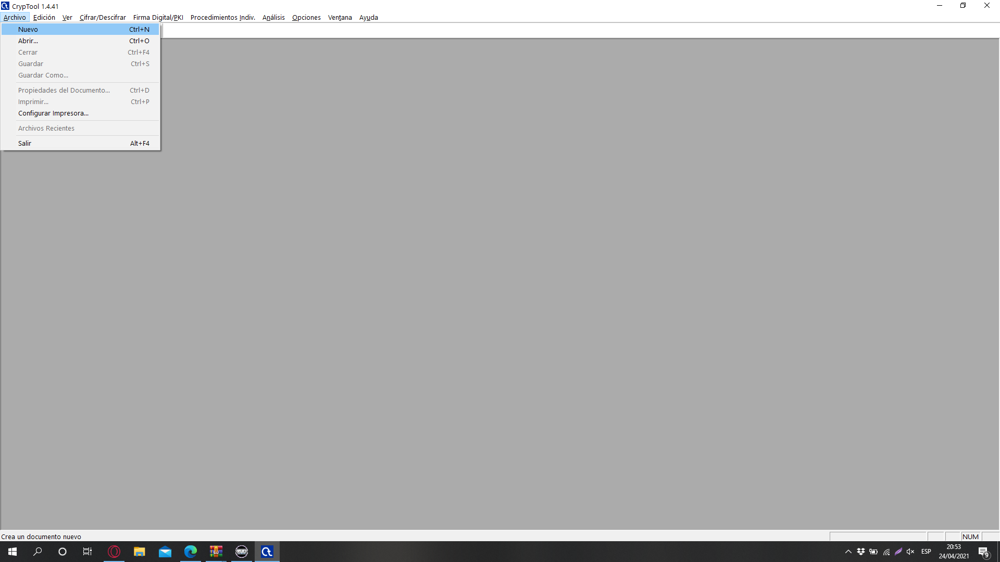

# Criptografía (Práctica 7)

> Ibai Guillén Pacho
> 

> Ing. Informática + TDE
> 

# Objetivo de la práctica

Encriptar la frase "Pienso pufar mi nota en seguridad de la información" con el algoritmo RC4 y desencriptarla por fuerza bruta.

# Herramientas

### CrypTool 1

CrypTool es un software libre que ilustra conceptos criptográficos. Es el programa de aprendizaje electrónico de uso más extendido en el mundo en el área de la criptología con más de 60 algoritmos implementados.

[CrypTool Portal](https://www.cryptool.org/en/)

# Práctica

## Mensaje

Para crear un documento en blanco en el que escribir el mensaje a encriptar hay que hacer clic en Archivo → Nuevo.

Se abrirá un documento en blanco en el que podremos escribir la frase que queramos encriptar.

## Cifrado

Para el cifrado habrá que ir a algoritmos y elegir el que queramos, en este caso el RC4.

Se nos abrirá una ventana donde nos preguntará que clave queremos utilizar:

---

Usaremos una clave de 24 bits bastante sencillita en hexadecimal:

> AAAFFF
> 

Cuyo valor binario es:

> 101010101010111111111111
> 

---

La introduciremos de la siguiente forma y le daremos a cifrar.

## Resultado del cifrado

El resultado podemos obtenerlo copiando el código hexadecimal o en texto ASCII.

Hexadecimal:

> AC D9 5A 03 AA EA EE 7F 9E E1 30 82 65 20 F3 F8 BA C1 2A 74 02 D7 79 12 19 82 7C 1B F2 3E 6F AA E2 FE 77 15 26 0A 99 57 A4 48 7F 7C 8A A1
C5 3B 23 A0 22
> 

---

Texto:

> ¬ÙZªêîžá0‚e óøºÁ*t×y‚|ò>oªâþw&
™W¤H|Š¡Å;# "
> 

## Descifrado por fuerza bruta

Para desencriptar el mensaje volveremos a CrypTool1.

Para crear un fichero nos iremos a Archivo → Nuevo

Meteremos el resultado que nos ha dado CrypTools y nos iremos al menú de Análisis, donde seleccionaremos el tipo de algoritmo para empezar un ataque de fuerza bruta. 

Se nos abrirá una ventana donde pondremos los bits que tenía la clave y le daremos a comenzar.

Es posible que el proceso se alargue en correspondencia a la potencia del dispositivo donde se ejecuta.

Cuando termina el proceso el resultado con menos entropía nos muestra el texto:

# Documentación

Documentación trabajada en Notion, link al formato original:

[Criptografía (Práctica 7)](https://www.notion.so/Criptograf-a-Pr-ctica-7-151ad763bcff4e8ca1e040e5af806b4f)
