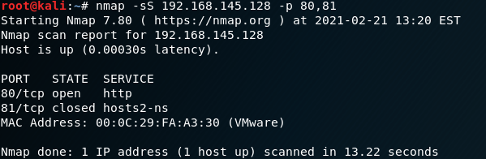

# Escaneo de puertos (Práctica 1)

> Ibai Guillén Pacho
> 

> Ing. Informática + TDE
> 

# Objetivo de la práctica

Con Wireshark capturando el tráfico de red, escanear los puertos 80 y 81 TCP de la máquina con Windows 2000 Server y analizarlos después.

# Herramientas

### Whireshark

Analizador de protocolos, utilizado para realizar análisis, solucionar problemas en redes de comunicaciones y para el análisis de datos y protocolos.

[Wireshark · Go Deep.](https://www.wireshark.org)

### NMAP

Programa de código abierto que sirve para efectuar rastreo de puertos.

[Nmap: the Network Mapper - Free Security Scanner](https://nmap.org/)

# Escaneo de puertos

Para poder escanear los puertos 80 y 81 de la víctima se ha usado la herramienta `nmap`, que para analizar los puertos 80 y 81 la IP 192.168.145.128 se ha usado el siguiente comando:

```bash
nmap -sS IP_víctima -p 80,81
```

Lo que ha dado como resultado que el puerto 80 tiene un servicio http detrás y el puerto 81 está cerrado.



# Paquetes transmitidos por la red

De la misma forma se ha abierto una instancia de `Whireshark` en paralelo y se ha capturado el trafico de la red durante la prueba.


Los resultados del escaneo han sido que el puerto 80 estaba abierto mientras que el 81 no, lo cual se puede entender analizando lo siguiente de la traza: 

- Se lanza una traza ARP para que nos digan la MAC que está detrás de la dirección IP de la que queremos escanear los puertos, necesaria para construir las trazas ethernet y comenzar a comunicarse.
    
    
    
    ---
    
- Una vez sabiendo que hay una máquina detrás de la dirección IP y teniendo su dirección MAC se tienen todos los datos necesarios para construir los paquetes y poder enviarlos. En este paso la máquina del hacker lanza dos peticiones a la victima, a los puertos 80 y 81 (trazas 18 y 19 respectivamente).
    
    
    
    De los paquetes enviados a esos puertos solo se tiene respuesta correcta del puerto 80 (traza 20).
    
    
    
    En la traza 21 se finaliza la conexión con el puerto 80 con un RST, de forma que la máquina deja de guardar recursos para gestionar esa conexión. Sin embargo, del puerto 81 se devuelve un RST ACK, lo que quiere decir que el puerto está cerrado.
    
    ---
    

# Documentación

Documentación trabajada en Notion, link al formato original:

[Escaneo de puertos (Práctica 1)](https://www.notion.so/Escaneo-de-puertos-Pr-ctica-1-fc400113b5e34617afd34cce7347a2d8)
