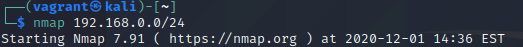

# LTE-Hacking-IbaiGuillénPacho

> **Ibai Guillén Pacho**
> 

> ibai.guillen@opendeusto.es
> 

> Ingeniería Informática + TDE
> 

---

# Objetivos de la práctica y descripción del ataque

El objetivo de este ataque es vulnerar la seguridad mi propia máquina Windows 10 desde una máquina virtual Kali Linux, creada con la herramienta Vagrant  sin ser detectados por el antivirus.

En este ataque se recreará una búsqueda de dispositivos vulnerables en nuestra red y explotará la vulnerabilidad [CVE-2014-3120](https://nvd.nist.gov/vuln/detail/CVE-2014-3120) de uno de ellos. 

Esta vulnerabilidad permite la ejecución remota de comandos en ElasticSearch porque la API REST no requiere autenticación y la función de búsqueda permite la ejecución de scripts dinámicos.

Gracias a esto se permite al atacante la ejecución remota de código Java, y por ende, la posibilidad de abrir una consola de comandos remota. 

---

# Análisis de la red

Para buscar vulnerabilidades en la red se utilizará la herramienta nmap para auditar los dispositivos conectados y sus puertos abiertos.

Una vez realizado el escaneo encontramos que el dispositivo alojado en la IP **192.168.0.37** tiene multitud de puertos abiertos de los cuales alguno podría estar siendo utilizado por alguna aplicación desactualizada y por lo tanto ser vulnerable.

Para analizar lo que hay detrás de estos puertos realizaremos un análisis más profundo, y para  
guardar el resultado de este análisis realizado usaremos el flag `-oX` para poder importarlo en metasploit y poder explotarlo en el workspace más tarde.

Entre los detalles de todos los puertos podemos encontrar que en el puerto 9200, el correspondiente a WAP Connectionless Session Service, hay un tagline que devuelve *"You Know, for Search"*, lo que nos da pistas de que hay un servidor de búsquedas ElasticSearch.

Además, como la versión es la 1.1.1 del 16 de abril de 2014 sabemos que este sistema puede ser vulnerable a la ejecución remota de código Java descrito en la vulnerabilidad [CVE-2014-3120](https://nvd.nist.gov/vuln/detail/CVE-2014-3120).

---

# Explotación de la vulnerabilidad

## Importación de los resultados del análisis de la red

Una vez descubierta la vulnerabilidad procederemos a explotarla mediante la herramienta metasploit, primero cargaremos el análisis en metasploit con `db_import`.

Para ojear todos los servicios escaneados bastará con escribir `services` para observar el analisis importado desde nmap.

## Búsqueda del exploit

Una vez importados los resultados del análisis en metasploit buscaremos un exploit que vulnere la seguridad de ElasticSearch con `search`.

Una vez encontrado el exploit que permite la ejecución remota de scripts Java lo seleccionaremos para usar, como este exploit está en la biblioteca de metasploit no hará falta descargarlo y valdrá con usar el comando `use` seguido del nombre.

---

## Funcionamiento del exploit

Este exploit lo podemos consultar en [exploitdb](https://www.exploit-db.com/exploits/33588) o buscando en el directorio de modulos de metasploit (*/usr/share/metasploit-framework/modules/*). Realiza los siguientes pasos durante su ejecución:

1. Comprobar si la máquina es vulnerable.
    1. Genera dos números aleatorios.
    2. Crea una variable a modo de fichero con EOF (End Of File) en la que se injecta el código que específica la suma de los dos números anteriores. 
    3. Lanza una petición al endpoint **_search** de la API de ElasticSearch con el script de la suma del paso anterior. 
    4. Si la respuesta de la API parseada a int no da como resultado la suma de los dos anteriores números la máquina es considerada no vulnerable y el exploit termina aquí, de lo contrario la máquina se considera vulnerable y script avanza a su siguiente estado.
2. Obtener el sistema operativo de la víctima.
    1. Generar un script que devuelva el sistema de la víctima con *System.getProperty("[os.name](http://os.name/)").*
    2. Realizar el mismo proceso de la petición a **_search.**
    3. Si se recibe respuesta avanza al siguiente paso, sino el script termina así.
3. Obtener el directorio temporal de Java.
    1. Igual que el paso 2 pero con lo siguiente: *System.getProperty(\"java.io.tmpdir\");*
4. Crear un archivo `.jar` en el directorio temporal de java de la víctima que servirá para arrancar el metasploit payload.
    1. Crear un fichero virtual cuya ruta será la de archivos temporales de windows y su nombre será aleatorio.
    2. Guardar el nombre del archivo con `register_file_for_cleanup()` para que sea eliminado al limpiar la sesión de metasploit.
    3. Crear un script que cree el fichero del subapartado uno, con el código que permita arrancar el payload de metasploit.
        
        
        
5. Si todo lo anterior ha salido bien debería dar como resultado una sesión válida de meterpreter.

---

## Configuración del exploit

Para saber que información se necesita para lanzar el ataque lanzaremos el comando `show options` para ver que variables necesitamos establecer.

Como podemos observar los atributos que deberemos cambiar son:

- La IP remota a la de la víctima a **192.168.0.37.**
- La IP local de la interfaz por la que escuchará la máquina, que está en la misma red que la victima, averiguable por el comando `ifconfig`, **192.168.0.44**
- El payload, será una shell normal **java/shell_reverse_tcp**

Una vez hayamos configurado el exploit lo lanzamos con el comando `run` y esperamos a ver el resultado.

---

## Resultado

Una vez lanzado el exploit podemos ver que ha sido un éxito y nos permite ejecutar comandos en la consola de la víctima. Podemos tanto navegar entre directorios (dir, cd, ...), observar los procesos ejecutándose, .. Hasta incluso ejecutar algún script local para escalar de privilegios y hacer cualquier cosa.

## Comentarios Adicionales

Tenemos que elegir bien cual será el payload que utilizaremos, de utilizar un payload como  **java/meterpreter/reverse_tcp** podríamos ser detectados por el antivirus de la víctima, puesto en cuarentena nuestro archivo que haría de puente, y, en el peor de los casos se podría llegar a abrir una investigación policial.

---

# Bibliografía

[rapid7/metasploitable3](https://github.com/rapid7/metasploitable3/wiki/Vulnerabilities)

[Fundamentals of Elasticsearch](https://medium.com/@sami.jan/fundamentals-of-elasticsearch-cbb273160f60)

[TCP 9200](https://www.auditmypc.com/tcp-port-9200.asp)

[CVE - CVE-2014-3120](https://cve.mitre.org/cgi-bin/cvename.cgi?name=2014-3120)

[NVD](https://nvd.nist.gov/vuln/detail/CVE-2014-3120)

[Offensive Security's Exploit Database Archive](https://www.exploit-db.com/exploits/33588)

[LTE-Hacking-IbaiGuillénPacho DEMO en video](https://youtu.be/1YGCfnw5nRc)

[LTE-Hacking-IbaiGuillénPacho notion](https://www.notion.so/LTE-Hacking-IbaiGuill-nPacho-37ef7ea3e1834b6496f5fca80d724188)
