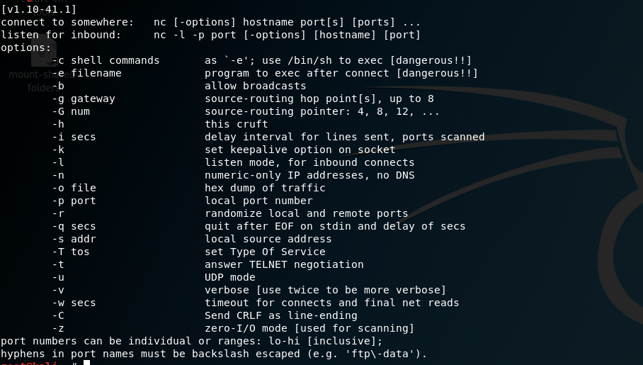

# Netcat (Práctica 4)

> Ibai Guillén Pacho
> 

> Ing. Informática + TDE
> 

# Objetivo de la práctica

Explorar las distintas opciones que proporciona netcat.

# Herramientas

### Netcat

Netcat es una herramienta de red que permite a través de intérprete de comandos y con una sintaxis sencilla abrir puertos TCP/UDP en un HOST, asociar una shell a un puerto en concreto y forzar conexiones UDP/TCP.

[netcat 1.11 for Win32/Win64](https://eternallybored.org/misc/netcat/)

# Funcionamiento

## Opciones disponibles

Para consultar las opciones disponibles del comando `nc` se puede escribir en consola `nc -h` para verlas:

## Conexión básica

Para crear una conexión básica, también llamada Knock Knock se abrirán dos terminales en la máquina, de forma en la que uno este a la escucha y el otro actúe de servidor.

Para esperar conexiones, es decir, actuar como servidor o como *"listener"* se utiliza el comando `nc -l -p 6666`, este comando pone a la consola a la escucha en el puerto 6666 y a la espera de una conexión.

Para crear un cliente netcat se utilizará el comando `nc localhost 6666`, de esta forma nos conectaremos al terminal que está a la escucha en el puerto 6666 de localhost. 

En el momento que la conexión se ha realizado cualquier entrada de consola que se realice en cualquiera de las dos terminales quedará reflejada en la otra.

## Escaneo de puertos

Netcat cuenta con una herramienta parecida a la que nos proporcionaba nmap en prácticas anteriores, para ejecutar este escaneo de puertos podremos usar el comando `nc -zv 192.168.145.130 1-100` para escanear todos los puertos desde el 1 al 100.

## Ejecución remota de comandos

La ejecución remota de comandos es algo fundamental en este tipo de ataques y es bastante fácil de realizar con netcat, tan solo hay que añadir `| /bin/bash` al cliente o al servidor dependiendo de donde quiere que se ejecuten estos comandos.

De esta forma si se añade al cliente cada vez que el servidor mande un comando se ejecutará en el cliente y viceversa.

Sin embargo, esto no es del todo funcional, ya que la máquina que lanza los ataques no ve la ejecución de los comandos, únicamente aparecen en la víctima. Para esto se puede realizar cierta modificación y añadir algunos parámetros más al comando de la víctima, haciendo no solo que reproduzca los comandos en el bash, sino que los envíe por otro puerto.

De esta forma el atacante se pone a la escucha en dos puertos, el 6666 y el 6667. Mientras tanto la víctima esta recibiendo como cliente los comandos desde el puerto 6666, ejecutándolos en /bin/bash y mandando esa información por el puerto 6667.

## Redirección de tráfico (Bouncing)

Como hemos visto anteriormente las posibilidades que ofrece netcat para la redirección de tráfico son inmensas, lo que nos permite redirigir el tráfico a través de tanto clientes como queramos. Podríamos redirigir el tráfico a través de varios clientes antes de llegar a la víctima, por ejemplo así:

1. El atacante abre un cliente para conectarse al puerto 9999.
    
    
    
2. Listener 1 escucha al atacante y crea un cliente para conectarse al puerto 9998.
    
    
    
3.  Listener 2 escucha al Listener 1 y crea un cliente para conectarse al puerto 6666 de la víctima.
    
    
    
4. La víctima escucha lo que recibe del Listener 2, lo ejecuta y crea un cliente para conectarse al puerto 6667 del atacante.
    
    
    
5. El atacante escucha el puerto 6667 de la víctima.
    
    
    

Quedaría de la siguiente forma:

## Troyanizando sin sobrecarga (Telnet Inverso)

Otra forma de realizar el ataque previo es valerse de la herramienta telnet, que aun estando obsoleta suele estar presente en muchos dispositivos, de forma que la parte de la víctima cambia un poco respecto a lo anterior.

- La víctima abre dos clientes en los puertos 6666 y 6667, de forma que ejecute todo lo que venga de 6666 y lo envíe por 6667.
    
    
    
    ---
    
- La consola del atacante usará la escucha del puerto 6666 para enviar los comandos.
    
    
    
    ---
    
- La consola del atacante escuchará por el puerto 6667 todo lo que ocur
    
    
    

De esta forma podemos ver como todos los comandos que se ejecuten funcionarán exactamente igual que con netcat.

# Documentación

Documentación trabajada en Notion, link al formato original:

[Netcat (Práctica 4)](https://www.notion.so/Netcat-Pr-ctica-4-894213361e7342f6bc1d0847b9e62098)
