# Documentación técnica de una aplicación con contenedores

> Jorge El Busto & Ibai Guillén
> 

> Ingeniería Informática + TDE
> 

---

# Objetivos de la práctica

Los objetivos de la práctica presentada y su ponderación son los siguientes.

- Instalación del software necesario (Docker, etc.) (10%).
- Creación de un contenedor con Apache + PHP (25%).
- Creación de un contenedor de volúmenes para la web y la base de datos (10%).
- Descarga de un contenedor con MySQL y puesta en marcha (10%).
- Conexión de los tres contenedores empleando enlaces de red y volúmenes en Docker (20%).
- Opcional: Creación de un contenedor con MySQL (25%).
- Pruebas de rendimiento (15%).
- Extras (10% como máximo).

---

# Requisitos de la práctica

- Para la creación de esta aplicación web con contenedores, se necesitará Docker Desktop, ya que Windows no soporta el Docker Engine tradicional, y los siguientes elementos:
    
    
    - MySQL
        
        <aside>
        ℹ️ MySQL es un sistema de gestión de bases de datos relacional.
        
        </aside>
        
    - WordPress
        
        <aside>
        ℹ️ WordPress es un sistema de gestión de contenidos enfocado a la creación de cualquier tipo de página web.
        
        </aside>
        
    
    - PHP
        
        <aside>
        ℹ️ PHP es un lenguaje de programación de uso general que se adapta especialmente al desarrollo web.
        
        </aside>
        
    - Apache
        
        <aside>
        ℹ️ Apache es un servidor web HTTP de código abierto.
        
        </aside>
        
    
    ---
    

# Instalación del software en Windows

## Docker

1. Buscar "Docker Desktop for Windows" en Google.
2. Acceder al enlace de Docker Hub.
3. Descargar el ejecutable.
4. Ejecutarlo y seguir los pasos de instalación.
5. Reiniciar el ordenador para finalizar la instalación.
6. Completar el tutorial de primeros pasos.

[Docker Desktop for Mac and Windows | Docker](https://www.docker.com/products/docker-desktop)

<aside>
ℹ️ Versión 2.5.0.0 utilizada

</aside>

---

## Windows Subsystem for Linux

1. Acceder a la página web de Microsoft.
2. Buscar, en el área de texto de la derecha, WSL.
3. Descargar el paquete de actualización más reciente de Linux para máquinas X64.
4. Instalarlo.

[Actualización del kernel de Linux en WSL 2](https://docs.microsoft.com/es-es/windows/wsl/wsl2-kernel)

# Creación del contenedor APACHE + PHP

<aside>
⚠️ A diferencia de la práctica anterior, esta vez se usarán contenedores en lugar de todo un sistema operativo. Mientras la máquina virtual se trata de todo un sistema operativo, el contenedor incluye simplemente una aplicación y una ligera capa que permite que dicha aplicación sea virtualizada.

</aside>

## Dockerfile

El `Dockerfile` se trata del documento que se debe crear en caso de querer crear una imagen de Docker propia. Una imagen de Docker está formada por el conjunto de contenedores que se quieren crear y las relaciones entre sí. La creación del fichero se ha llevado a cabo mediante documentación oficial de Docker.

[Dockerfile reference](https://docs.docker.com/engine/reference/builder/)

## Sistema operativo

La versión de Linux que se utilizará como capa de virtualización de la aplicación será la 18.04 de Ubuntu. Para ello, en la primera línea del `Dockerfile` se añadirá , que especificará el sistema operativo y versión que se quiere utilizar.

<aside>
⚠️ Es recomendable utilizar un sistema operativo **estable**, en lugar de la última versión, debido a la compatibilidad de comandos. Cuando la imagen quede obsoleta, ya se adaptará el `Dockerfile`, pero mientras se tendrá la total garantía de que la imagen funcionará durante mucho tiempo.

</aside>

## Comandos

Una vez se haya especificado el sistema operativo a utilizar (mediante la etiqueta `FROM`) y se haya escrito el nombre de los autores del fichero (mediante la utilización de la etiqueta `LABEL`), se pasará a especificar qué comandos se quieren ejecutar durante el tiempo de creación de la imagen. 

<aside>
💡 Cabe destacar que el `RUN`, se ejecuta durante la creación de la imagen,mientras que el `provision` de `Vagrant`, se ejecutaba después de haber creado ya la máquina virtual.

</aside>

En lugar de escribir un `RUN` por cada comando, se poden escribir todos de manera seguida uniéndolos mediante etiquetas `and` (`&&` en Linux). 

Mediante la etiqueta `ENV`, se especificarán algunas variables de entorno necesarias para la correcta configuración del contenedor de `Apache`. 

Adicionalmente, se especificará la zona horaria, para que no se pida durante el proceso de construcción de la imagen. Para evitar que se solicite información adicional se especificará que *frontend* no es interactivo.

La etiqueta `EXPOSE` permitirá mostrar el contenido del puerto 80 del contenedor, que servirá para futuras conexiones, y la etiqueta `VOLUME` permite crear un volumen desde dentro de un `Dockerfile`. Además, copiaremos nuestro `wp-config` del directorio sobre el que ejecutemos el build al volumen en el que se vaya a crear el contenedor Wordpress.

```docker
FROM ubuntu:18.04

LABEL author="Jorge El Busto <jorge.elbusto@opendeusto.es>"
LABEL author="Ibai Guillén <ibai.guillen@opendeusto.es>"

RUN export DEBIAN_FRONTEND="noninteractive" && \
    export TZ="Europe/Madrid" && \
    apt-get update && apt-get install -y \
    apache2 \
    php \
    php-mysql \
    wget \
    && rm -rf /var/lib/apt/lists/* \
    rm /var/www/html/index.html

ENV APACHE_RUN_USER www-data
ENV APACHE_RUN_GROUP www-data
ENV APACHE_LOG_DIR /var/log/apache2
ENV APACHE_PID_FILE /var/run/apache2.pid
ENV APACHE_RUN_DIR /var/run/apache2
ENV APACHE_LOCK_DIR /var/lock/apache2

EXPOSE 80

VOLUME ["/var/www/html"]

COPY wp-config.php /var/www/html/wp-config.php
COPY entrypoint.sh /usr/local/bin/
```

Posteriormente, se especificará un `ENTRYPOINT` , que se trata de un ejecutable sobre el cual se aplicarán una serie de parámetros que especificaremos mediante la etiqueta `CMD`. Dicho fichero se tratará más tarde, en el apartado referente al contenedor de Wordpress.

```docker
ENTRYPOINT [ "/usr/local/bin/entrypoint.sh" ]
CMD ["-D", "FOREGROUND"]
```

---

# Creación de un contenedor de volúmenes para la web y la base de datos

Con el paso de la instalación del contenedor de `Wordpress` realizado anteriormente, se descargaba un contenedor oficial de `Wordpress` desde `Docker`. El objetivo es crear una imagen `Wordpress` propia. Para ello, serán de vital importancia volúmenes de Docker, que son directorios que se crean tanto en el equipo real como en el contenedor para almacenar una serie de ficheros que sean especificados. Se crea un volumen llamado `vol-web` para Wordpress, y otro llamado `vol-db` para la base de datos.

```bash
docker volume create vol-web
docker volume create vol-db
```

---

# Descarga de un contenedor con MySQL y puesta en marcha

Para descargar el contenedor de `MySQL` y ponerlo en marcha, se tendrá que ejecutar el comando que se muestra a continuación. Este comando tiene de especial el parámetro `--mount`, haciendo referencia al volumen de la máquina real desde el cual se pretende copiar una serie de ficheros al contenedor Docker recién creado. Además, para evitar conflictos, se especificará desde un primer momento que la versión del contenedor de `MySQL` será la 5.6.

```bash
docker run --name db --mount source=vol-db,target=/var/lib/mysql -e MYSQL_ROOT_PASSWORD=secret -d mysql:5.6
```

<aside>
ℹ️ Además de asignar el nombre al contenedor, se ha incluido el parámetro `—e` con el argumento `MYSQL_ROOT_PASSWORD=secret` para especificar la creación de un entorno con la contraseña secret en MySQL, dee gran utilidad a la hora de crear la base de datos en el contenedor web.

</aside>

---

# Conexión de los tres contenedores empleando enlaces de red y volúmenes en Docker

## Entrypoint y construcción de la imagen

Deberá establecerse un nuevo `Entrypoint` para el contenedor personalizado de `Wordpress`. El `Entrypoint` establecido será un fichero ejecutable, escrito en Bash que cuente con una serie de comandos. 

En este caso, este `Entrypoint` servirá para comprobar que el `Wordpress` está tanto descargado como configurado. En caso contrario, procederá a realizar los ajustes pertinentes de descarga y copia del fichero de configuración de `Wordpress` antes de lanzar `Apache`. A este fichero habrá que darle permisos con el comando `chmod`  para que todo el proceso del Dockerfile pueda realizarse correctamente.

```bash
#!/bin/bash
# Comprobar si Wordpress está descargado
if [ ! -f /var/www/html/wp-login.php ]
then
	#Si no está descargado, descargamos Wordpress
	wget -c "http://wordpress.org/latest.tar.gz"
	tar xzf latest.tar.gz
	mv wordpress/* /var/www/html
fi
#Comprobar si el Wordpress está configurado
if [ ! -f /var/www/html/wp-config.php ]
then
	cp /root/wp-config.php /var/www/html/wp-config.php
fi
#Una vez está todo listo, se ejecuta Apache2
/usr/sbin/apache2 -D FOREGROUND
```

Para ejecutar el `Dockerfile` y crear la imagen, se tendrá que ejecutar el siguiente comando. El punto hace referencia al directorio en el que se encuentra el `Dockerfile` (en este caso al estar ejecutando la línea de comandos sobre ese mismo directorio, se pone un punto). El flag `-t` hace referencia al nombre de la imagen que queremos crear.

```powershell
docker build -t myapache2 .
```

Esto sería la salida de la consola una vez ejecutado el comando que crea la imagen `Docker`.

```powershell
require_once ABSPATH . 'wp-settings.php';
[+] Building 109.5s (9/9) FINISHED
 => [internal] load .dockerignore                                                                                                                                                                             
 => => transferring context: 2B                                                                                                                                                                               
 => [internal] load build definition from Dockerfile                                                                                                                                                          
 => => transferring dockerfile: 32B                                                                                                                                                                           
 => [internal] load metadata for docker.io/library/ubuntu:18.04                                                                                                                                               
 => [internal] load build context                                                                                                                                                                             
 => => transferring context: 3.38kB                                                                                                                                                                           
 => CACHED [1/4] FROM docker.io/library/ubuntu:18.04@sha256:646942475da61b4ce9cc5b3fadb42642ea90e5d0de46111458e100ff2c7031e6                                                                                  
 => [2/4] RUN export DEBIAN_FRONTEND="noninteractive" &&     export TZ="Europe/Madrid" &&     apt-get update && apt-get install -y     apache2     php     php-mysql     wget     && rm -rf /var/lib/apt/l  
 => [3/4] COPY wp-config.php /root/wp-config.php                                                                                                                                                              
 => [4/4] COPY entrypoint.sh /usr/local/bin/                                                                                                                                                                  
 => exporting to image                                                                                                                                                                                        
 => => exporting layers                                                                                                                                                                                       
 => => writing image sha256:4ba8e7d916ec488c105aa2bd897cc972f5540455313a7d540e92ebc4f92e6a5d                                                                                                                  
 => => naming to docker.io/library/myapache2
```

## Creación del contenedor Wordpress

Para inicializar un contenedor "personalizado" de `Wordpress` se tendrá que utilizar el comando inferior, en el cual se especifica que el volumen a utilizar será el volumen que se ha creado previamente destinado a la página web, `vol-web`. 

Cabe destacar la adición del parámetro extra `-p`, el cual indica el puerto por el que se quiere realizar la conexión, en este caso, desde el puerto 8080 de la máquina real al puerto 80 del contenedor `Wordpress` que será creado. 

El parámetro `--link` otorga al contenedor de `MySQL` el nombre de ***mysql**,* de esta forma, podremos acceder a él desde el contenedor de `Wordpress` a través de ese nombre, a pesar de que su nombre real sea ***db*** (como una especie de DNS resolviendo una dirección local).

```docker
docker run --name web --mount source=vol-web,target=/var/www/html --link=db:mysql -p 8080:80 -d myapache2
```

Si la instalación del contenedor `myapache2` ha sido exitosa, tecleando la dirección IP ***localhost***, se podrá acceder a la pantalla de configuración de `Wordpress` y configurarla.


<aside>
ℹ️ Si se teclea el comando `docker exec -it web /bin/bash` y se accede al contenido de la carpeta `/var/www/html`, se podrán encontrar todos los ficheros de configuración de `Wordpress` ahí. Lanzando el comando `cat` se puede visualizar el contenido del `wp-config.php`,después de esto se ha de sacar al directorio compartido, también llamado volumen, el fichero `wp-config.php`. En este caso el directorio es el `vol-web` mencionado en el comando de `Docker` correspondiente a `Wordpress`.

</aside>

---

# Pruebas de rendimiento

## Elaborando los scripts con ApacheBench y GNUPlot

Para las pruebas de rendimiento del contenedor Wordpress, igual que la práctica anterior se ha utilizado **ApacheBench**, un programa provisto por Apache que permite realizar un análisis exhaustivo del rendimiento de servidores HTTP. 

Para lograr extraer los ficheros a raíz de los cuales se elaborarán los gráficos analizando los resultados obtenidos, se ha de crear un fichero ejecutable de Linux, `test.sh`.  En este fichero se especificarán el número de peticiones a realizar, y destacan los *flags* `-c` y `-n`. El primero indica el número de peticiones concurrentes que se realizarán, y el segundo indica a secas el número de peticiones a realizar. 

Además, utilizamos el *flag* `-g` y pasamos como parámetro el fichero de valores separado por tabuladores al que queremos exportar los datos. De esta manera, tendremos salidas en ficheros tanto *tsv* como *log*, para luego poder elegir los datos relevantes para elaborar los gráficos con más comodidad.

```bash
#!/bin/bash 
	 for N in 100 500 1000 5000 10000 50000
	 do
		for C in 1 5 10 50 100 500 1000
		do
			echo "Testing -n $N -c $C..."
			ab -g test-$N-$C.tsv -n $N -c $C http://127.0.0.1:8080/ &> test-$N-$C.log
		done
	done
```

Respecto a la elaboración de gráficos, esta vez se ha optado por una forma diferente de elaborarlos, aprovechando una herramienta disponible en Linux como es **Gnuplot**. Se ha creado un fichero `ab-result.plot`, que generará un gráfico con los valores que haya en el fichero `.tsv` generado previamente por ApacheBench. 

Para realizar este paso, se ha recurrido a una documentación abierta en **GitHub** que explica de forma clara y concisa los pasos a realizar para generar un gráfico de **ApacheBench**.

[Plotando gráficos do Apache benchmark](https://gist.github.com/augustohp/5865018)

```bash
set terminal jpeg size 1200,500
set size 1, 1
set output "graph10000-100.jpg"
set title "Benchmark testing"
set key left top
set grid y
set xdata time
set timefmt "%s"
set format x "%S"
set xlabel 'segundos'
set ylabel "Tiempo de respuesta (ms)"
set datafile separator '\t' 
plot "test-10000-100.tsv" every ::2 using 2:5 title '10000 peticiones / 100 concurrentes' with points
exit
```

Además, se ha creado otro fichero para crear el plot desde un enfoque diferente, midiendo el tiempo de respuesta en consonancia con el número de peticiones.

```bash
set terminal png size 600
set output "graph100-10_2.png"
set title "100 peticiones, 10 peticiones concurrentes"
set size ratio 0.6
set grid y
set xlabel "Peticiones"
set ylabel "Tiempo de respuesta (ms)"
plot "test-100-10.tsv" using 9 smooth sbezier with lines title "Práctica 2 - Jorge e Ibai"
exit
```

Después, se ejecutan los comandos `sudo gnuplot ab-result.plot` y `sudo gnuplot ab-result2.plot` para sacar los resultados a un fichero de imagen. 

## Análisis de resultados

1. 100 peticiones
    
    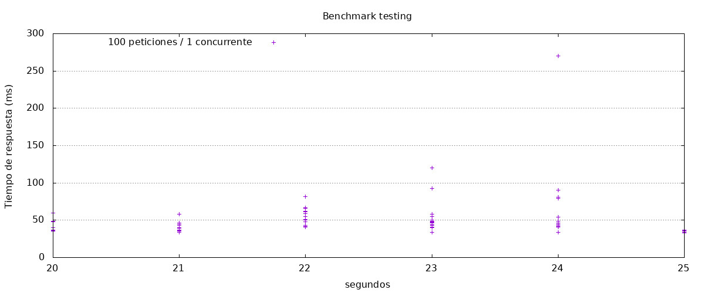
    
    Con 100 peticiones y 1 conexión concurrente podemos ver como recibimos datos bastante homogéneos, la mayoría de las conexiones se concentran por debajo de los 50ms, aunque haya casos especiales donde el tiempo de respuesta se alarga hasta casi los 300ms. 
    
    En este caso  no debemos preocuparnos, puesto que estos casos aislados no se alargan demasiado como para ser molesto.
    
    ---
    
    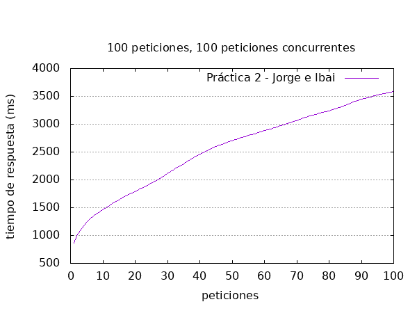
    
    Sin embargo, al contrario que en el caso anterior podemos observar que con 100 peticiones con 100 conexiones concurrentes la cosa cambia bastante. En este caso podemos observar como a medida que el número de peticiones sube el tiempo de respuesta lo hace de la misma forma, podríamos decir que es una progresión lineal.
    
    El comportamiento es lógico y no se observan anomalías, ya que el gráfico no muestra un % de peticiones anómalas por encima del resto, en otros gráficos se pueden observar anomalías que pueden servir para entender esto.
    
    ---
    
2. 500 peticiones
    
    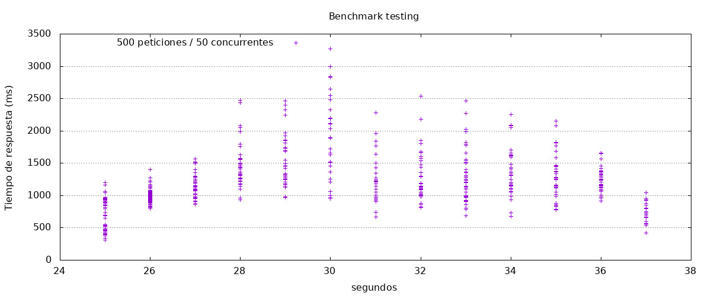
    
    Con 500 peticiones y 50 peticiones concurrentes podemos observar como el comportamiento parece parabólico, es decir, la máquina se comporta bien con pocas peticiones, pero a medida que estas pocas peticiones se van demorando van generando retrasos en las siguientes, de modo que a la mitad de esta prueba (segundo 30) podemos ver como el tiempo de respuesta se ve bastante diferente y muy diferente a las demás.
    
    Esto se irá normalizando en los siguientes segundos hasta ser más estable. Aún así, el tiempo de respuesta está por encima del segundo por regla general, así que podemos decir que este contenedor no es capaz de dar una buena experiencia de usuario bajo esta demanda.
    
    ---
    
    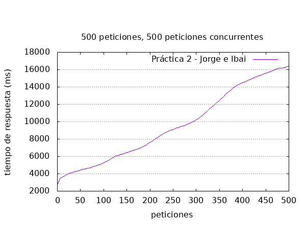
    
    Si con 50 peticiones por segundo el tiempo de respuesta era bastante, con 500 podemos ver como esto se convierte en un verdadero problema, ya no es que no se ofrezca una buena experiencia de usuario, es que ningún sistema se puede permitir tiempos de respuesta por encima de los 2 segundos.
    
    El gráfico sigue la misma progresión lineal que la de para 100 peticiones, no hay anomalías pero eso no quita de que este contenedor sea insuficiente para la carga que debe afrontar.
    
    ---
    
3. 100 peticiones
    
    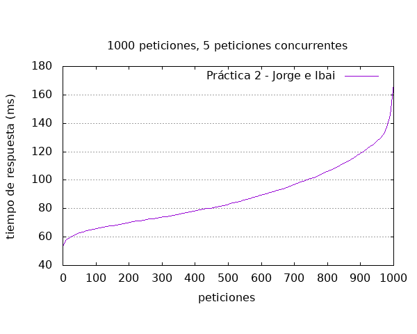
    
    Esta gráfica representa las 5 peticiones concurrentes 1000 veces, y nos muestra como el tiempo de respuesta es medianamente estable por debajo de los 120ms, sin embargo un bajo porcentaje de peticiones sube de estos 120ms a los 160, esto quiere decir que la desviación típica es de unos 40ms, nada grave ni reseñable teniendo en cuenta que son solo 5 peticiones concurrentes.
    
    Más adelante veremos que a medida que aumentan las peticiones concurrente el comportamiento difiere bastante de este.
    
    ---
    
    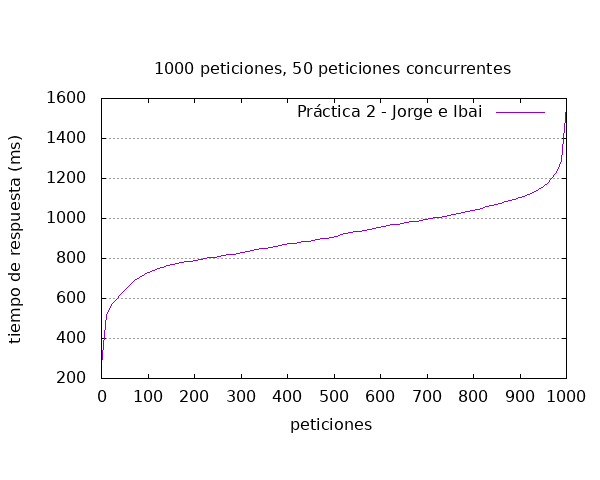
    
    Con 50 peticiones recurrentes el comportamiento, aunque sigue una distribución de tiempo similar, ha escalado, situándose el el 70% de las peticiones por debajo del segundo, y el 30% restante entre 1 segundo y uno y medio. En este caso la desviación típica es mayor, acaparando el 30% de los casos.
    
    Esto quiere decir que cada vez va variando más el tiempo de respuesta y será difícil encontrar correlaciones.
    
    ---
    
    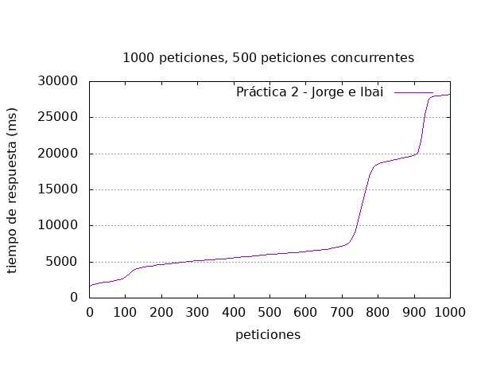
    
    Con 500 peticiones por segundo podemos observar como tan solo el 20% de las peticiones se sitúan por debajo de los 5 segundos, el 50% se sitúa poco por encima de los 5 segundos, y un 30% por encima de los 10 segundos.
    
    Sucede una anomalía entre las 800 y 1000 peticiones, parece que el tiempo se estabiliza pero vuelve a escalar, lo que nos da a entender que el contenedor trata de gestionar las cargas y logra estabilizar los tiempo de respuesta, que aun siendo altos, es capaz de dar respuesta.
    
    Pero vemos que es bastante inestable, y que tarda muy poco tiempo en volver a generar tiempos de respuesta superiores.
    
    ---
    
    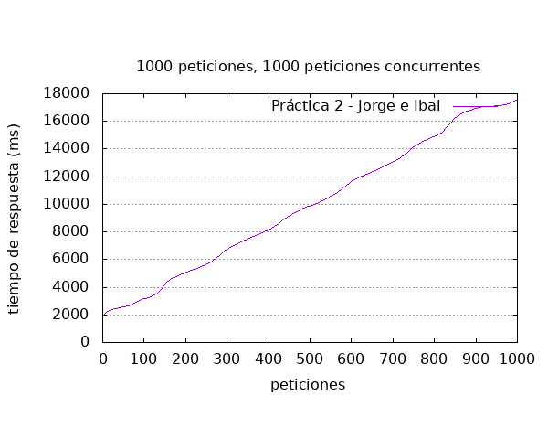
    
    En este caso, al igual que en los anteriores en los que el número de repeticiones es igual al de peticiones recurrentes vemos que sigue una progresión lineal.
    
    Poco más que añadir, es lo mismo que los anteriores casos pero con mayor escala.
    
    ---
    
4. 5.000 peticiones
    
    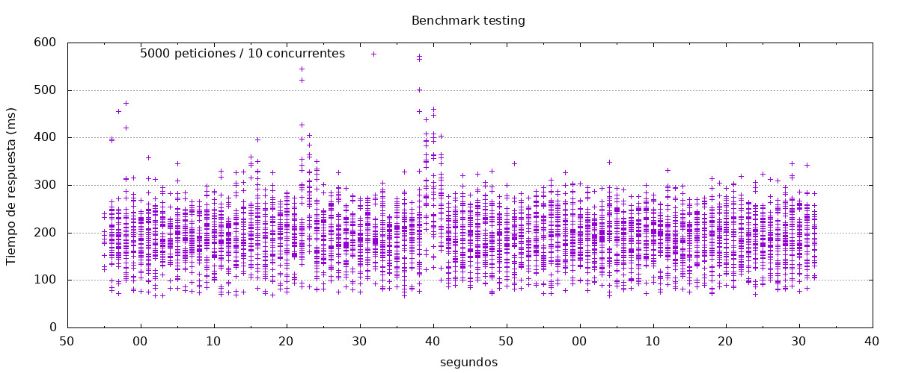
    
    En este caso al igual que en los anteriores en los que el número de solicitudes concurrentes es bajo, podemos ver como el tiempo de respuesta es bastante uniforme y en su gran mayoría se sitúa por debajo de los 300ms, aunque la desviación típica en muy pocos casos ascienda hasta 600ms.
    
    Nada reseñable y con muy buen rendimiento ante esta carga.
    
    ---
    
    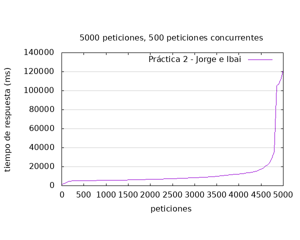
    
    Con 5000 peticiones recurrentes hemos elegido este gráfico para representar cómo ante una carga considerable el contenedor daba tiempos de respuesta bastante altos, dando desviaciones de hasta 120 segundos, algo totalmente inviable.
    
    ---
    
    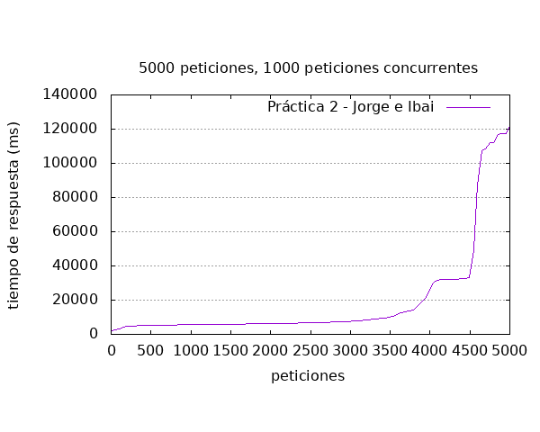
    
    En este caso al igual que con 1000 repeticiones y 500 peticiones concurrentes podemos ver como parece que el contenedor logra estabilizar los tiempos de respuesta después de las 4000 peticiones, pero al igual que en el anterior caso mencionado, esto es inestable y logra dilatarse hasta los 100 - 120 segundos.  
    
    ---
    
5. 10.000 peticiones
    
    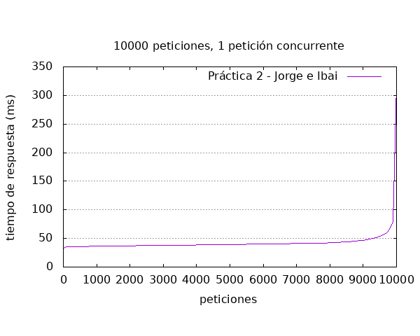
    
    Al igual que en todos los casos con 1 petición recurrente el tiempo de respuesta es ínfimo y da igual cuantas repeticiones se hagan que el contenedor es capaz de aguantar la carga dando desviaciones que aun siendo grandes comparados con la media, ninguna supera los 300ms, por lo cual inapreciables.
    
    ---
    
    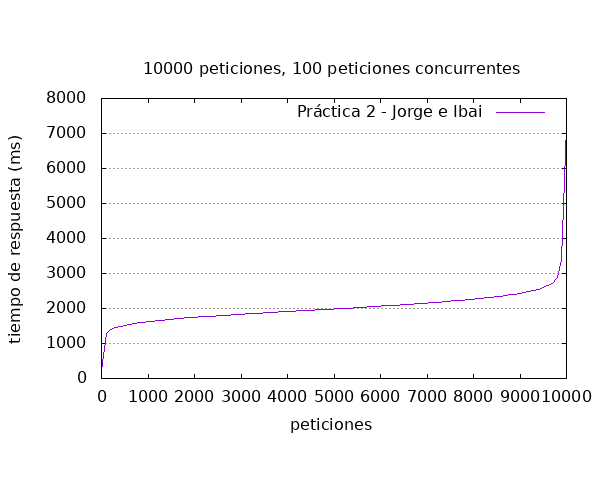
    
    Con 100 peticiones concurrentes 10000 veces podemos ver que el 99% de los casos se sitúa entre el segundo y los 3 segundos, algo entendible debido a la carga aplicada y que no da señales de problemas puesto que muy pocos casos se encuentran lejos de este marco. El más significativo es un caso que ha tardado 6 segundos, pero que puede deberse al estado del ordenador utilizado en ese momento, no disponemos de evidencias para tomarlo como algo importante.
    
    ---
    
    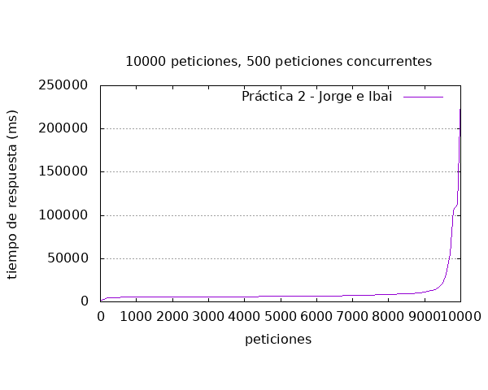
    
    De nuevo podemos ver como al final de la prueba con 500 peticiones 10.000 veces el contenedor parece querer estabilizarse pero no lo consigue, dando máximas superiores a los 200 segundos.
    
    Esta carga es insoportable para este sistema y decidimos cortar las pruebas de rendimiento en este momento porque ya hemos obtenido datos suficientes como para obtener el veredicto de que el contenedor funciona correctamente con hasta 25 peticiones recurrentes. Por lo cual habría que generar más instancias de este contenedor a partir de este número de peticiones para balancear la carga y poder dar tiempos de respuesta por debajo de los 500ms.
    
    ---
    

# Extras

Como extras añadidos a la práctica, hemos de destacar un par de aspectos.

- Como todos los pasos anteriores tienen cierta complicación hemos decidido utilizar la herramienta `docker-compose` para presentar una alternativa a los pasos anteriores.

Para la creación de este contenedor utilizando esta herramienta hay que declarar un archivo `docker-compose.yml` y dentro de él incluir el siguiente código:
    
    ```bash
    version: '3.3'
    services:
      db:
        image: mysql
        restart: always
        environment:
           MYSQL_DATABASE: wordpress_db
           MYSQL_ROOT_USER: root
           MYSQL_ROOT_PASSWORD: root
           MYSQL_USER: wordpress
           MYSQL_PASSWORD: wordpress
        ports:
          # <Port exposed> : < MySQL Port running inside container>
          - '3306:3306'
        # Where our data will be persisted
        volumes:
          - ./data-wordpress/sql:/var/lib/mysql
      wordpress:
         depends_on:
           - db
         image: wordpress:latest
        # Where our data will be persisted
         volumes:
           - ./data-wordpress/html:/var/www/html
         ports:
           - "8000:80"
         expose:
          # Opens port 8000 on the container
          - '8000'
         restart: always
         environment:
           WORDPRESS_DB_HOST: db
           WORDPRESS_DB_USER: wordpress
           WORDPRESS_DB_PASSWORD: wordpress
           WORDPRESS_DB_NAME: wordpress_db
    ```
    
    Además habrá que crear tres carpetas, `data-wordpress` y dentro de ella `sql` y `html`. Estas estarán sincronizadas con las carpetas de dentro de los contenedores para no perder la información cuando se cierre o se borre el contenedor *(Como la carpeta compartida de la `vagranbox`).* 
    
    Para ejecutarlo bastaría con ejecutar `docker-compose up` en el directorio. Podras hacer `docker-compose down` para borrar el contenedor sin miedo a perder los datos gracias a lo anterior mencionado.
    
    ---
    
- Wordpress es compatible con multitud de arquitecturas, sin embargo, la imagen oficial de MySQL no da soporte para la arquitectura ARM. Es por eso que hemos buscado una solución para esos casos, encontrando una imagen MySQL modificada para dar soporte a esta arquitectura, [biarms/mysql](https://hub.docker.com/r/biarms/mysql) ha sido la que hemos elegido. Por lo cual el `docker-compose` se quedaría así:
    
    ```bash
    version: '3.3'
    services:
      db:
        image: biarms/mysql:5.5.60
        restart: always
        environment:
           MYSQL_DATABASE: wordpress_db
           MYSQL_ROOT_USER: root
           MYSQL_ROOT_PASSWORD: root
           MYSQL_USER: wordpress
           MYSQL_PASSWORD: wordpress
        ports:
          # <Port exposed> : < MySQL Port running inside container>
          - '3306:3306'
        # Where our data will be persisted
        volumes:
          - ./data-wordpress/sql:/var/lib/mysql
    
      wordpress:
         depends_on:
           - db
         image: wordpress:latest
         volumes:
           - ./data-wordpress/html:/var/www/html
         ports:
           - "8000:80"
         expose:
          # Opens port 8000 on the container
          - '8000'
         restart: always
         environment:
           WORDPRESS_DB_HOST: db
           WORDPRESS_DB_USER: wordpress
           WORDPRESS_DB_PASSWORD: wordpress
           WORDPRESS_DB_NAME: wordpress_db
    ```
    
    La forma de ejecutarlo sería la misma que en arquitectura x86, lo único que esta vez podrá ejecutarse en ARM, por ejemplo una raspberry.
    
    ---
    
- Por último, como se ha podido ver a lo largo de esta documentación, se le ha aplicado un tiempo mayor que el necesario, nos hemos tomado la molestia de hacer una documentación muy detallada, muy dinámica y sobre todo, muy profesional.
    
    Por eso hemos realizado la documentación en [Notion](http://www.notion.so), una herramienta que nos permite crear la documentación en su portal web y exportarlo a *markdown*, formato estandarizado en las wikis de GitHub. Además, permite generar un link de acceso a lectura público o exportar la documentación a HTML en caso de querer publicarla online.
    
    [Notion - The all-in-one workspace for your notes, tasks, wikis, and databases.](http://www.notion.so)
    
    ---
    

  

En caso de querer consultar esta documentación en su formato original:

[Documentación técnica de una aplicación con contenedores](https://www.notion.so/Documentaci-n-t-cnica-de-una-aplicaci-n-con-contenedores-660595dba3b44073a815f96697dfd37c)

-
