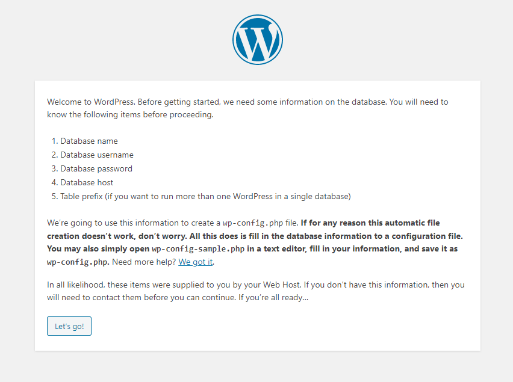

# Documentación técnica de una aplicación web virtualizada

> Jorge El Busto & Ibai Guillén
> 

> Ingeniería Informática + TDE
> 

---

# Objetivos de la práctica

Los objetivos de la práctica presentada a continuación y su ponderación son los siguientes.

- Instalación del software necesario (Vagrant, VirtualBox, etc.) (10%).
- Creación de la Vagrant box y configuración básica (15%).
- Conexión a la Vagrant box mediante SSH (10%)
- Aprovisionamiento de la Vagrant box para soportar la aplicación web (35%).
- Instalación de la aplicación web virtualizada (Wordpress) en la Vagrant Box (15%).
- Pruebas de rendimiento (15%).
- Extras (10% como máximo).

---

# Requisitos de la práctica

- Para la creación de esta aplicación web virtualizada se necesitarán los siguientes elementos:
    
    
    - MySQL
        
        <aside>
        ℹ️ MySQL es un sistema de gestión de bases de datos relacional.
        
        </aside>
        
    - WordPress
        
        <aside>
        ℹ️ WordPress es un sistema de gestión de contenidos enfocado a la creación de cualquier tipo de página web.
        
        </aside>
        
    
    - PHP
        
        <aside>
        ℹ️ PHP es un lenguaje de programación de uso general que se adapta especialmente al desarrollo web.
        
        </aside>
        
    - Apache
        
        <aside>
        ℹ️ Apache es un servidor web HTTP de código abierto.
        
        </aside>
        
    
    ---
    

# Instalación del software en Windows

## Vagrant

1. Ir a la página principal de Vagrant.
2. Acceder al apartado de descargas.
3. Descargar el ejecutable.
4. Ejecutarlo y seguir los pasos de instalación.
5. Finalmente reiniciar el ordenador para finalizar la instalación.

[Vagrant by HashiCorp](https://www.vagrantup.com)

<aside>
ℹ️ Versión 2.2.10 utilizada

</aside>

---

## VirtualBox

1. Ir a la página principal de VirtualBox.
2. Acceder al apartado de descargas.
3. Descargar el ejecutable.
4. Ejecutarlo y seguir los pasos de instalación.
5. Es recomendable reiniciar el ordenador para finalizar la instalación.

[Oracle VM VirtualBox](https://www.virtualbox.org)

<aside>
ℹ️ Versión 6.1.14 utilizada

</aside>

# Creación y Configuración de la Vagrant box

## Crear el entorno Vagrant

<aside>
ℹ️ La Vagrant Box utilizada como base será la Ubunu Bionic, pero pueden usarse diferentes.

</aside>

Para crear el entorno Vagrant se debe crear un `VagrantfIle`, para ello hay que situarnos sobre la carpeta en la que se quiera crearlo, abrir una consola de comandos y a continuación escribir el siguiente comando.

```bash
vagrant init ubuntu/bionic64
```

<aside>
🛠 En caso de no tener claro aún que sistema operativo se va a utilizar como base se puede ejecutar el comando `vagrant init` para crear un `Vagrantfile` genérico y editarlo a posteriori.

</aside>

Si el proceso ha terminado correctamente debería mostrarse lo siguiente en la consola:

```
A Vagrantfile has been placed in this directory. You are now ready to vagrant up your first virtual environment! Please read the comments in the Vagrantfile as well as documentation on vagrantup.com for more information on using Vagrant.
```

---

## Configuración del Vagrantfile

<aside>
💡 El `Vagrantfile` es el archivo de configuración que se utiliza para construir la máquina virtual donde se declaran y modifican las propiedades que tendrá esta.

</aside>

Dentro del `Vagrantfile` hay muchas propiedades, pero en este caso no son todas necesarias y solo se tendrán en cuenta las siguientes:

- En el `Vagrantfile` se especifica el sistema operativo base de la máquina. Si se han realizado los pasos previos de la creación del entorno no habría que modificar esta propiedad. En caso de no haberlo hecho de esta forma, o de haber seleccionado una imagen distinta por error se debe modificar la propiedad para que quede de la siguiente forma.
    
    ```ruby
    config.vm.box = "ubuntu/bionic64"
    ```
    
- Para esta aplicación web habrá que habilitar el acceso a la máquina virtual a través de la red, para esto habrá que configurar lo siguiente.
    - Para conceder el acceso privado a la máquina local a través de un puerto específico (para no exponer la máquina en la red):
        
        ```ruby
        config.vm.network "forwarded_port", guest: 80, host: 8080, host_ip:"127.0.0.1"
        ```
        
    - Para conceder acceso público a todos los dispositivos conectados a la red.
        
        ```ruby
        config.vm.network "public_network", ip: "192.168.0.160"
        ```
        
- Para compartir archivos entre el ordenador y la máquina virtual hay que habilitar una carpeta compartida que se creará en el mismo directorio del `Vagrantfile`. En este caso la carpeta se llamará `config`.
    
    ```ruby
    config.vm.synced_folder "config", "/vagrant_data"
    ```
    
- Para configurar los recursos asignados a la máquina y aprovisionarla de la memoria necesaria para su correcto funcionamiento se debe modificar los siguientes atributos de la siguiente forma. Es posible mostrar en pantalla la máquina virtual si se desea.
    
    ```ruby
    config.vm.provider "virtualbox" do |vb|
    #   # Display the VirtualBox GUI when booting the machine
      vb.gui = true
    #
    #   # Customize the amount of memory on the VM:
      vb.memory = "1024"
    end
    #
    ```
    
- Para realizar el aprovisionamiento se utilizará un shell script. Para esto habrá que crear el script `.sh`, que en este caso se llamará *`vm.sh`* y modificar la propiedad de aprovisionamiento de inline a path y especificar la ruta del archivo, en este caso al estar en la misma ruta que el `Vagrantfile` no hay que poner la ruta absoluta.
    
    ```ruby
    config.vm.provision "shell", path: "vm.sh"
    ```
    

---

## Conexíon SSH

Para conexión SSH con la máquina habrá que abrir una consola de comandos en el directorio mientras la máquina este encendida y ejecutar

```bash
vagrant ssh
```

## Aprovisionamiento de la VagrantBox

<aside>
ℹ️ Este paso solo es necesario si se quiere aprovisionar a la máquina con más elementos de los que trae de por sí.

</aside>

El aprovisionamiento se realizará a través de un script como se ha mencionado en la configuración del `Vagrantfile`. Este script ha de ser capaz de instalar todos los requisitos de la máquina virtual (PHP, MySQL, Apache y Wordpress). 

1. Añadir el encabezado del script para que este sea interpretado como un bash script.
    
    ```bash
    #!/usr/bin/env bash
    ```
    
    ---
    
2. Actualizar la lista de paquetes disponibles y sus versiones.
    
    ```bash
    apt-get -y update
    ```
    
    <aside>
    💡 El flag -y es utilizado para que la operación se realice sin necesidad de confirmaciones adicionales.
    
    </aside>
    
    ---
    
3. Actualizar los paquetes instalados a la versión estable más reciente por motivos de seguridad.
    
    ```bash
    apt-get -y upgrade
    ```
    
    ---
    
4. Instalar apache
    
    ```bash
    apt-get install -y apache2
    ```
    
    ---
    
5. Instalar PHP y sus plugins
    
    ```bash
    apt-get install -y php php-mysql
    ```
    
    ---
    
6. Reiniciar Apache
    
    ```bash
    systemctl restart apache2
    ```
    
    ---
    
7. Eliminar el index.html generado por Apache, instalar wordpress y eliminar los archivos residuales.
    
    ```bash
    #Remove Apache Index
    cd /var/www/html/ 
    rm index.html
    #Download Wordpress and extract it
    wget http://wordpress.org/latest.tar.gz -nc -nv
    tar -xzf latest.tar.gz
    rsync -a  wordpress/* .
    rm latest.tar.gz
    rm -rf wordpress/
    ```
    
    ---
    
8. Instalar MySQL con usuario y contraseña **root**.
    
    ```bash
    debconf-set-selections <<< 'mysql-server mysql-server/root_password password **root**'	
    debconf-set-selections <<< 'mysql-server mysql-server/root_password_again password **root**'
    apt-get install -y mysql-server
    apt-get install -y mysql-client 
    ```
    
    ---
    
9. Crear las Bases de datos y usuarios para wordpress.
    
    ```bash
    mysql -u root --password=root -e "CREATE DATABASE wordpress;"
    mysql -u root --password=root -e "create user 'wp_user'@'localhost' identified by 'wp_pass';"
    mysql -u root --password=root -e "grant all on wordpress.* to 'wp_user'@'localhost';"
    mysql -u root --password=root -e "flush privileges;"
    ```
    
    ---
    
10. Cargar el archivo de configuración de Wordpress desde la carpeta compartida 
    
    <aside>
    ⚠️ Si es la primera vez que se instala Wordpress y no cuentas con un fichero `wp-config.php` este paso no podrás realizarlo aún y deberás configurar wordpress a través del portar web.
    
    </aside>
    
    ```bash
    cp /vagrant_data/wp-config.php /var/www/html/wp-config.php
    ```
    
    - Configuración de MySQL y Wordpress desde el portal web
        
        Para empezar, hay que teclear la dirección IP que se ha asignado para esta máquina en el `Vagrantfile` (127.0.0.1:8080 o 192.168.0.160). Si los pasos en el `Vagrantfile` se han realizado correctamente, debe aparecer una ventana como la siguiente.
        
        
        
        Avanzando a lo largo de la página, aparecerá un formulario que habrá que rellenar con los mismos datos que figuran en la base de datos de Wordpress previamente creada en el script de aprovisionamiento (usuario, contraseña...). 
        
        Si los datos introducidos son correctos, se nos generarán unas líneas de código que tendremos que pegar en nuestra máquina virtual. 
        
        <aside>
        ⚠️ Si el siguiente código no se muestra en el servidor web puede ser porque se hayan asignado permisos a Apache para poder crear archivos en el directorio, en ese caso se habrá creado el fichero `wp-config.php` en `/var/www/html`.
        
        </aside>
        
        ```php
        <?php
        define( 'DB_NAME', 'wordpress' );
        define( 'DB_USER', 'wp_user' );
        define( 'DB_PASSWORD', 'wp_pass' );
        define( 'DB_HOST', 'localhost' );
        define( 'DB_CHARSET', 'utf8mb4' );
        define( 'DB_COLLATE', '' );
        define( 'AUTH_KEY',         'BT1eSP+ki=qKpIAZ%tVwM/VP?l[`~^t36|y==a=xK8^*dch;sx)VpCG/x7gN|Vp,' );
        define( 'SECURE_AUTH_KEY',  'p9G]5MB@(W#Oq_t9K$q!a$I$B0HP7JT46`E2[Wg%|NZXyCliRdDd(crCemzoQK2;' );
        define( 'LOGGED_IN_KEY',    'fW (s5a?>_/tJO^GKJN t|_85(LuI>|r_N:D[KeB ?tO^Y-5YvA!eWZ}4yT]N1@t' );
        define( 'NONCE_KEY',        ']2CV5)rC[Gar+$xW$|,$>fWe?P8 VK px\{\%@-S +.5a+a(U+g64=_y^SBbnN:$%K' );
        define( 'AUTH_SALT',        'sTud;r=ap4*PS#w6QUYL${?N>3#^X:Qm<g`BzE9ai69~`iSYt,Vqj)jzx&Zy(+ku' );
        define( 'SECURE_AUTH_SALT', '}~i`C[tFb)+<1xDqox,f>TLNX_/TJ~jm5J1|cMAXG@@h1i ]4dsf@QEgt>):NnY3' );
        define( 'LOGGED_IN_SALT',   ']=K~+LzaP=~0Tdr0w6q[o!;z7^TFsHj>v72ZW)D?1HjcW !)?|X[bqE,ZO5y$8~G' );
        define( 'NONCE_SALT',       '9E&zzOGw%`I|vk&prdyk $~pK[$IbOf @IXxA^BRRr5-PsM3H>N(.A6fX3w.?-B}' );
        
        $table_prefix = 'wp_';
        define( 'WP_DEBUG', false );
        if ( ! defined( 'ABSPATH' ) ) {
        	define( 'ABSPATH', __DIR__ . '/' );
        }
        require_once ABSPATH . 'wp-settings.php';
        ```
        
        Estas líneas se tendrán que pegar en un fichero llamado `wp-config.php`, creado con:
        
        ```bash
        sudo nano /var/www/html/wp-config.php
        ```
        
        Este fichero de configuración deberá ser copiado a la carpeta compartida `/vagrant_data` con el objetivo de que en la próxima instalación no sea necesario realizar los pasos de configuración manualmente a través del portal web.
        
        De esta forma, en la siguiente instalación bastará con copiar el fichero directamente de `/vagram_data` a `/var/www/htm` para cargar la configuración referente a la base de datos.
        
        ---
        
11. Reiniciar la máquina
    
    ```bash
    reboot
    ```
    
    ---
    

## Crear la máquina virtual acorde al Vagrantfile

<aside>
❗ Asegúrese de tener abierto VirtualBox

</aside>

Para inicializar la máquina **habría que ejecutar en el mismo directorio en el que está el `Vagrantfile` el siguiente comando.

```bash
vagrant up
```

Una vez escrito, la máquina se aprovisionará con todo lo que necesite, mostrando información similar a la siguiente por consola. 

```bash
Bringing machine 'default' up with 'virtualbox' provider...
==> default: Importing base box 'ubuntu/bionic64'...
==> default: Matching MAC address for NAT networking...
==> default: Checking if box 'ubuntu/bionic64' version '20201014.0.0' is up to date...
==> default: Setting the name of the VM: pr1_default_1602785075430_28400
==> default: Clearing any previously set network interfaces...
==> default: Available bridged network interfaces:
1) Intel(R) Dual Band Wireless-AC 8260
2) Hyper-V Virtual Ethernet Adapter
==> default: When choosing an interface, it is usually the one that is
==> default: being used to connect to the internet.
==> default:
    default: Which interface should the network bridge to? 1
==> default: Preparing network interfaces based on configuration...
    default: Adapter 1: nat
    default: Adapter 2: hostonly
    default: Adapter 3: bridged
==> default: Forwarding ports...
    default: 80 (guest) => 8080 (host) (adapter 1)
    default: 22 (guest) => 2222 (host) (adapter 1)
==> default: Running 'pre-boot' VM customizations...
==> default: Booting VM...
==> default: Waiting for machine to boot. This may take a few minutes...
    default: SSH address: 127.0.0.1:2222
    default: SSH username: vagrant
    default: SSH auth method: private key
    default:
    default: Vagrant insecure key detected. Vagrant will automatically replace
    default: this with a newly generated keypair for better security.
    default:
    default: Inserting generated public key within guest...
==> default: Machine booted and ready!
		(...)
```

<aside>
ℹ️ Una vez la máquina se haya encendido se ejecutará el script de aprovisionamiento y habrá que esperar hasta que termine, en caso de no haber modificado el aprovisionamiento se instalarán los elementos esenciales para el funcionamiento de la imagen seleccionada en el primer paso.

</aside>

---

# Creación de la aplicación web en Wordpress

Una vez la maquina virtual de Vagrant este funcionando al acceder a la dirección IP asignada a esta en el `Vagrantfile` (127.0.0.1:8080 o 192.168.0.160, según desde dónde accedamos) se mostrará el formulario de creación del sitio web como el siguiente.


Una vez configurados el usuario y la contraseña, estará lista la aplicación web virtualizada.


---

# Pruebas de rendimiento

Para ejecutar el script de ApacheBench, se ha de crear un fichero llamado [`test.sh`](http://test.sh) que se ejecutará mediante el bash de la consola de Linux más adelante que contenga las cantidades de requests, el fichero de salida y la dirección ip del servidor.

```bash
#!/bin/bash 
	 for N in 100 500 1000 5000 10000 50000
	 do
		for C in 1 5 10 50 100 500 1000
		do
			echo "Testing -n $N -c $C..."
			ab -n $N -c $C http://192.168.0.160/ &> test-$N-$C.log
		done
	done
```

Una vez ejecutado el script, que tardará un buen rato debido a la gran cantidad de peticiones que se han de realizar al servidor, dará como resultado varios ficheros .log que habrán sido exportados durante la ejecución del script, que servirán para analizar diferentes factores. Los datos del fichero .log los hemos pasado a un .csv desde el cual hemos ido realizando diferentes gráficos y comparativas. 

<aside>
⚠️ **NOTA**: Podíamos haber exportado el .csv directamente de ApacheBench, pero optamos por no hacerlo porque de los .log se podía extraer una cantidad infinitamente mayor de información relevante.

</aside>

Para realizar los gráficos, hemos optado por emplear otro lenguaje de programación, esta vez obviamente con fines de análisis estadístico, como es R. Este es el script que hemos utilizado para mostrar los diagramas.

```r
datos <- read.csv("datoslog2.csv")
boxplot(pet_por_segundo~peticiones,data=datos, ylim=c(0,125))
boxplot(pet_por_segundo~peticiones,data=datos)
```

Aquí vemos una relación claramente proporcional como es el tiempo empleado para realizar pruebas y el número de peticiones realizadas.


Respecto al número de peticiones por segundo, este gráfico sí que resulta realmente curioso, porque nos aporta un dato bastante significativo y tranquilizador, como el hecho de que el número de peticiones por segundo, en todo momento, ha mostrado un valor constante durante todas las pruebas de rendimiento (entre 550 y poco más de 800), sin ningún valor atípico en el diagrama de cajas y bigotes. 


<aside>
ℹ️ Había otro atributo, el **ratio de transferencia** en kilobytes por segundo, que mantenía una proporcionalidad muy parecida al número de peticiones por segundo, dado que el resultado del diagrama de cajas y bigotes contenía exactamente la misma apariencia que el diagrama que hemos puesto anteriormente, pero con los valores del eje Y multiplicados por tres.

</aside>

# Extras

Como extras añadidos a la práctica, hemos de destacar un par de aspectos.

- Por un lado, en lugar de ejecutar los comandos de aprovisionamiento de la caja Vagrant en el mismo fichero de `Vagrantfile`, en el *inline*, hemos optado por crear un fichero `.sh` con todos los comandos que se podrían introducir de manera convencional en el *inline* (instalación de paquetes, comandos de MySQL, descompresión e instalación de Wordpress...), y dar la orden al `Vagrantfile` de ejecutar el fichero mediante el siguiente parámetro.
    
    ```ruby
    config.vm.provision "shell", path: "[vm.sh](http://vm.sh/)"
    ```
    
    ---
    
- Por otra parte, en lugar de crear los gráficos de los análisis de rendimiento con un programa que ya puede crear gráficos a partir de hojas de cálculo, como puede ser *Excel*, hemos optado por crearlos utilizando un lenguaje de programación funcional como R.
    
    Para realizarlos, hemos tenido que crear un script en R el cual leía el `.csv`, lo formalizaba y generaba los gráficos por pantalla según los parámetros pasados.
    
    ```r
    datos <- read.csv("datoslog2.csv")
    boxplot(pet_por_segundo~peticiones,data=datos, ylim=c(0,125))
    boxplot(pet_por_segundo~peticiones,data=datos)
    ```
    
    ---
    
- Además, como muestra de buena práctica hemos añadido al script de aprovisionamiento algo imprescindible en lo relativo a seguridad:
    
    ```bash
    apt-get -y update
    apt-get -y upgrade
    ```
    
    Gracias a esto, se actualiza la lista de paquetes disponibles y sus versiones en `/etc/apt/sources.list` y se instalan las versiones más recientes de todos los paquetes listados en ese `sources.list`. Así se obtendrán las versiones más actualizadas de los elementos del sistema, lo que implica que las aplicaciones tendrán los últimos parches de seguridad y nuestra aplicación web virtualizada tendrá menos vulnerabilidades.
    
    ---
    
- Por último, como se ha podido ver a lo largo de esta documentación se le ha aplicado un tiempo mayor que el necesario, nos hemos tomado la molestia de hacer una documentación muy detallada, muy dinámica y sobre todo, muy profesional.
    
    Por eso hemos realizado la documentación en [Notion](http://www.notion.so), una herramienta que nos permite crear la documentación en su portal web y exportarlo a markdown, formato estandardizado en las wikis de github. Además, permite generar un link de acceso a lectura público o exportar la documentación a html en caso de querer publicarla online.
    
    [Notion - The all-in-one workspace for your notes, tasks, wikis, and databases.](http://www.notion.so)
    

  

En caso de querer consultar esta documentación en su formato original:

[Documentación técnica de una aplicación web virtualizada](https://www.notion.so/Documentaci-n-t-cnica-de-una-aplicaci-n-web-virtualizada-29b035377ffc4d6d8963d0c616f0e7bb)
