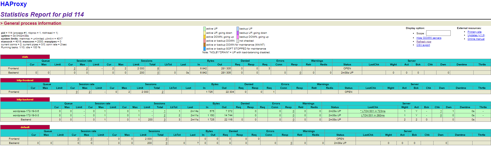

# Documentación técnica de una arquitectura web con balanceo de carga

> Jorge El Busto & Ibai Guillén
> 

> Ingeniería Informática + TDE
> 

---

# Objetivos de la práctica

Los objetivos de la práctica presentada y su ponderación son los siguientes.

- Arquitectura web escalable con Vagrant:
    - Creación de 4 VMs (web1, web2, db y lb) con Vagrant (30%).
    - Configuración de HAProxy y en la VM lb con Vagrant y visualización de estadísticas (15%).
    - Pruebas de rendimiento (10%).
- Arquitectura web escalable con Docker:
    - Creación de contenedores Docker (web, db y lb) (20%).
    - Configuración mediante Docker Compose de una orquestación de contenedores escalable (15%).
    - Pruebas de rendimiento (10%).
- Extras (10% como máximo).

---

# Requisitos de la práctica

- Para la creación de una arquitectura web con balanceo de carga, se necesitará `Docker Desktop`, ya que Windows no soporta el `Docker Engine` tradicional, `Docker Compose`, `Vagrant` y los siguientes elementos:
    
    
    - MySQL
        
        <aside>
        ℹ️ MySQL es un sistema de gestión de bases de datos relacional.
        
        </aside>
        
    
    - WordPress
        
        <aside>
        ℹ️ WordPress es un sistema de gestión de contenidos enfocado a la creación de cualquier tipo de página web.
        
        </aside>
        
    
    - PHP
        
        <aside>
        ℹ️ PHP es un lenguaje de programación de uso general que se adapta especialmente al desarrollo web.
        
        </aside>
        
    - Apache
        
        <aside>
        ℹ️ Apache es un servidor web HTTP de código abierto.
        
        </aside>
        
    - HAProxy
        
        <aside>
        ℹ️ HAProxy es un equilibrador de carga de alta disponibilidad.
        
        </aside>
        
    
    ---
    

# Instalación del software en Windows

## Docker

1. Buscar "Docker Desktop for Windows" en Google.
2. Acceder al enlace de Docker Hub.
3. Descargar el ejecutable.
4. Ejecutarlo y seguir los pasos de instalación.
5. Reiniciar el ordenador para finalizar la instalación.
6. Completar el tutorial de primeros pasos.

[Docker Desktop for Mac and Windows | Docker](https://www.docker.com/products/docker-desktop)

<aside>
ℹ️ Versión 2.5.0.0 utilizada

</aside>

<aside>
💡 Docker Desktop para Windows incluye Compose

</aside>

---

## Windows Subsystem for Linux

1. Acceder a la página web de Microsoft.
2. Buscar, en el área de texto de la derecha, WSL.
3. Descargar el paquete de actualización más reciente de Linux para máquinas X64.
4. Instalarlo.

[Actualización del kernel de Linux en WSL 2](https://docs.microsoft.com/es-es/windows/wsl/wsl2-kernel)

---

## Vagrant

1. Ir a la página principal de Vagrant.
2. Acceder al apartado de descargas.
3. Descargar el ejecutable.
4. Ejecutarlo y seguir los pasos de instalación.
5. Finalmente reiniciar el ordenador para finalizar la instalación.

[Vagrant by HashiCorp](https://www.vagrantup.com)

<aside>
ℹ️ Versión 2.2.10 utilizada

</aside>

---

## VirtualBox

1. Ir a la página principal de VirtualBox.
2. Acceder al apartado de descargas.
3. Descargar el ejecutable.
4. Ejecutarlo y seguir los pasos de instalación.
5. Es recomendable reiniciar el ordenador para finalizar la instalación.

[Oracle VM VirtualBox](https://www.virtualbox.org)

<aside>
ℹ️ Versión 6.1.14 utilizada

</aside>

---

# Arquitectura web escalable con Vagrant

## Creación de las máquinas virtuales

El objetivo de este módulo de la práctica es el de crear 4 máquinas virtuales, una correspondiente a la base de datos, dos correspondientes a los servicios `Wordpress` disponibles y la última será un servidor `proxy` que será el encargado de balancear la carga entre los contenedores.

Cómo los pasos de configuración básicos de `Vagrant` han sido mencionados en la [Documentación técnica de una aplicación web virtualizada](https://www.notion.so/Documentaci-n-t-cnica-de-una-aplicaci-n-web-virtualizada-29b035377ffc4d6d8963d0c616f0e7bb) su explicación será omitida durante el proceso de configuración actual.

- Configuración correspondiente a las máquinas virtuales:
    - Máquina virtual con MySQL
        - Carpeta sincronizada
            
            Para mantener la configuración y datos de la base de datos aunque la máquina sea eliminada se ha decidido crear una carpeta llamada `db-data`, para sincronizar y salvar los ficheros de `MySQL` de la máquina virtual en `/var/lib/mysql`.
            
        - Vagrantfile
            
            ```ruby
            config.vm.define :db  do |db|
                db.vm.hostname = "db"
                db.vm.network "private_network", ip: "192.168.100.99"
                db.vm.synced_folder "db-data", "/var/lib/mysql"
                db.vm.network "forwarded_port", guest: 3306, host: 3306
                db.vm.provision "shell", path: "mysql.sh"
                db.vm.provider "virtualbox" do |vb|
                  vb.memory = "1024"
                end
              end
            ```
            
        - Script de aprovisionamiento
            
            ```bash
            #!/usr/bin/env bash
            
            apt-get -y update
            apt-get -y upgrade
            
            debconf-set-selections <<< 'mysql-server mysql-server/root_password password root'	
            debconf-set-selections <<< 'mysql-server mysql-server/root_password_again password root'
            apt-get install -y mysql-server
            apt-get install -y mysql-client 
            mysql -u root --password=root -e "CREATE DATABASE wordpress;"
            mysql -u root --password=root -e "create user 'wp_user'@'%' identified by 'wp_pass';"
            mysql -u root --password=root -e "grant all on wordpress.* to 'wp_user'@'%';"
            mysql -u root --password=root -e "flush privileges;"
            sed -i "s/127.0.0.1/0.0.0.0/g" /etc/mysql/mysql.conf.d/mysqld.cnf
            service mysql restart
            ```
            
        
        ---
        
    - Máquina virtual con HAProxy
        - Carpeta sincronizada
            
            Para cargar la configuración del `proxy` en la máquina virtual se ha decidido crear una carpeta llamada `proxy-config` con el fichero de configuración `haproxy.cfg`, de esta forma, copiando el archivo de configuración dentro de la máquina virtual el `proxy` quedaría configurado.
            
        - Vagrantfile
            
            ```ruby
            config.vm.define :proxy  do |proxy|
                  proxy.vm.hostname = "proxy"
                  proxy.vm.synced_folder "proxy-config", "/vagrant_data"
                  proxy.vm.network :private_network, ip: "192.168.100.100"
                  proxy.vm.network "forwarded_port", guest: 80, host: 8080
                  proxy.vm.provision "shell", path: "proxy.sh"
                  proxy.vm.provider "virtualbox" do |vb|
                    vb.memory = "1024"
                  end
              end
            ```
            
        - Script de aprovisionamiento
            
            ```bash
            #!/usr/bin/env bash
            
            apt-get -y update
            apt-get -y upgrade
            
            apt-get -y install haproxy
            
            cp /vagrant_data/haproxy.cfg /etc/haproxy/haproxy.cfg
            service haproxy restart
            ```
            
        - Archivo de configuración haproxy.cfg
            
            <aside>
            💡 Se entrará en detalle más adelante.
            
            </aside>
            
            ```bash
            global
                    log /dev/log    local0
                    log /dev/log    local1 notice
                    chroot /var/lib/haproxy
                    stats socket /run/haproxy/admin.sock mode 660 level admin expose-fd listeners
                    stats timeout 30s
                    user haproxy
                    group haproxy
                    daemon
            
                    # Default SSL material locations
                    ca-base /etc/ssl/certs
                    crt-base /etc/ssl/private
            
                    # Default ciphers to use on SSL-enabled listening sockets.
                    # For more information, see ciphers(1SSL). This list is from:
                    #  https://hynek.me/articles/hardening-your-web-servers-ssl-ciphers/
                    # An alternative list with additional directives can be obtained from
                    #  https://mozilla.github.io/server-side-tls/ssl-config-generator/?server=haproxy
                    ssl-default-bind-ciphers ECDH+AESGCM:DH+AESGCM:ECDH+AES256:DH+AES256:ECDH+AES128:DH+AES:RSA+AESGCM:RSA+AES:!aNULL:!MD5:!DSS
                    ssl-default-bind-options no-sslv3
            
                    
            defaults
                    log     global
                    mode    http
                    option  httplog
                    option  dontlognull
                    timeout connect 5000
                    timeout client  50000
                    timeout server  50000
                    errorfile 400 /etc/haproxy/errors/400.http
                    errorfile 403 /etc/haproxy/errors/403.http
                    errorfile 408 /etc/haproxy/errors/408.http
                    errorfile 500 /etc/haproxy/errors/500.http
                    errorfile 502 /etc/haproxy/errors/502.http
                    errorfile 503 /etc/haproxy/errors/503.http
                    errorfile 504 /etc/haproxy/errors/504.http
            
            frontend http_front
                    bind *:80
                    stats uri /haproxy?stats
                    stats auth username:password
                    default_backend http_back
            
            backend http_back
                    balance roundrobin
                    server web1 192.168.100.101:80 check
                    server web2 192.168.100.102:80 check
            ```
            
        
        ---
        
    - Máquinas virtuales Wordpress
        - Carpeta sincronizada
            
            El objetivo de estas n máquinas virtuales es la de tener tantas instancias Wordpress idénticas como queramos para que nuestra aplicación soporte el mayor número de peticiones por segundo.
            
            Además, debido a la redundancia de estas máquinas virtuales se ha decidido modificar los procesos de aprovisionamiento para optimizar el tiempo, de modo que, en vez de descargarse Wordpress dentro de cada máquina virtual habrá que descargarlo con antelación y colocarlo en la carpeta compartida `web-config`.
            
            Por lo cual en la carpeta compartida deberían de encontrarse dos cosas, la carpeta `wordpress` con la descarga de `Wordpress` dentro y el fichero `wp-config.php`.
            
        - Vagrantfile
            
            <aside>
            ⚠️ La declaración de la variable debe ser antes de que empiece la configuración del `Vagrantfile`.
            
            </aside>
            
            ```bash
            $num_instances = 2
            Vagrant.configure("2") do |config|
            ...
            ```
            
            ```ruby
            (1..$num_instances).each do |i|
                config.vm.define vm_name = "%s-%02d" % ["web", i] do |web_config|
                  web_config.vm.synced_folder "web-config", "/vagrant_data"
                  host_ip = "192.168.100.#{i+100}"
                  web_config.vm.network "private_network", ip: host_ip
                  web_config.vm.provision "shell", path: "web.sh"
                  web_config.vm.provider "virtualbox" do |vb|
                    vb.memory = "1024"
                  end
                end
              end
            ```
            
            <aside>
            💡 Con este bucle podremos crear tantas máquinas `Wordpress` como queramos con el simple cambio de la variable `$num_instances`.
            
            </aside>
            
        - Script de aprovisionamiento
            
            ```bash
            #!/usr/bin/env bash
            
            apt-get -y update
            apt-get -y upgrade
            apt-get install -y apache2 php php-mysql
            rm /var/www/html/index.html
            cp -R /vagrant_data/wordpress/* /var/www/html
            cp /vagrant_data/wp-config.php /var/www/html/wp-config.php
            service apache2 restart
            ```
            
        - Fichero de configuración Wordpress wp-config.php
            
            ```php
            <?php
            /**
             * The base configuration for WordPress
             *
             * The wp-config.php creation script uses this file during the
             * installation. You don't have to use the web site, you can
             * copy this file to "wp-config.php" and fill in the values.
             *
             * This file contains the following configurations:
             *
             * * MySQL settings
             * * Secret keys
             * * Database table prefix
             * * ABSPATH
             *
             * @link https://wordpress.org/support/article/editing-wp-config-php/
             *
             * @package WordPress
             */
            
            // ** MySQL settings - You can get this info from your web host ** //
            /** The name of the database for WordPress */
            define( 'DB_NAME', 'wordpress' );
            
            /** MySQL database username */
            define( 'DB_USER', 'wp_user' );
            
            /** MySQL database password */
            define( 'DB_PASSWORD', 'wp_pass' );
            
            /** MySQL hostname */
            define( 'DB_HOST', '192.168.100.99' );
            
            /** Database Charset to use in creating database tables. */
            define( 'DB_CHARSET', 'utf8mb4' );
            
            /** The Database Collate type. Don't change this if in doubt. */
            define( 'DB_COLLATE', '' );
            
            /**#@+
             * Authentication Unique Keys and Salts.
             *
             * Change these to different unique phrases!
             * You can generate these using the {@link https://api.wordpress.org/secret-key/1.1/salt/ WordPress.org secret-key service}
             * You can change these at any point in time to invalidate all existing cookies. This will force all users to have to log in again.
             *
             * @since 2.6.0
             */
            define( 'AUTH_KEY',         'BT1eSP+ki=qKpIAZ%tVwM/VP?l[`~^t36|y==a=xK8^*dch;sx)VpCG/x7gN|Vp,' );
            define( 'SECURE_AUTH_KEY',  'p9G]5MB@(W#Oq_t9K$q!a$I$B0HP7JT46`E2[Wg%|NZXyCliRdDd(crCemzoQK2;' );
            define( 'LOGGED_IN_KEY',    'fW (s5a?>_/tJO^GKJN t|_85(LuI>|r_N:D[KeB ?tO^Y-5YvA!eWZ}4yT]N1@t' );
            define( 'NONCE_KEY',        ']2CV5)rC[Gar+$xW$|,$>fWe?P8 VK px\{\%@-S +.5a+a(U+g64=_y^SBbnN:$%K' );
            define( 'AUTH_SALT',        'sTud;r=ap4*PS#w6QUYL${?N>3#^X:Qm<g`BzE9ai69~`iSYt,Vqj)jzx&Zy(+ku' );
            define( 'SECURE_AUTH_SALT', '}~i`C[tFb)+<1xDqox,f>TLNX_/TJ~jm5J1|cMAXG@@h1i ]4dsf@QEgt>):NnY3' );
            define( 'LOGGED_IN_SALT',   ']=K~+LzaP=~0Tdr0w6q[o!;z7^TFsHj>v72ZW)D?1HjcW !)?|X[bqE,ZO5y$8~G' );
            define( 'NONCE_SALT',       '9E&zzOGw%`I|vk&prdyk $~pK[$IbOf @IXxA^BRRr5-PsM3H>N(.A6fX3w.?-B}' );
            
            /**#@-*/
            
            /**
             * WordPress Database Table prefix.
             *
             * You can have multiple installations in one database if you give each
             * a unique prefix. Only numbers, letters, and underscores please!
             */
            $table_prefix = 'wp_';
            
            /**
             * For developers: WordPress debugging mode.
             *
             * Change this to true to enable the display of notices during development.
             * It is strongly recommended that plugin and theme developers use WP_DEBUG
             * in their development environments.
             *
             * For information on other constants that can be used for debugging,
             * visit the documentation.
             *
             * @link https://wordpress.org/support/article/debugging-in-wordpress/
             */
            define( 'WP_DEBUG', false );
            
            /* That's all, stop editing! Happy publishing. */
            
            /** Absolute path to the WordPress directory. */
            if ( ! defined( 'ABSPATH' ) ) {
            	define( 'ABSPATH', __DIR__ . '/' );
            }
            
            /** Sets up WordPress vars and included files. */
            require_once ABSPATH . 'wp-settings.php';
            ```
            
        
        ---
        

## Resultado

Resumiendo y reuniendo todo lo anteriormente mencionado se ha de recordar que la estructura de ficheros y sus contenidos sería la siguiente.

Donde `web-config/wordpress` tendría el contenido descargado de `Wordpress` antes de lanzar las máquinas virtuales.

```bash
├───**Vagrantfile**
├───**mysql.sh**
├───**proxy.sh**
├───**web.sh**
├───db-data
├───proxy-config
│   └───**haproxy.cfg**
└───web-config
    ├───*wordpress*
		│   └───**...**
		└───**web-config.php**
```

---

`Vagrantfile`

```ruby
# -*- mode: ruby -*-
# vi: set ft=ruby :

$num_instances = 2

Vagrant.configure("2") do |config|
  config.vm.box = "ubuntu/bionic64"
  
  config.vm.define :db  do |db|
    db.vm.hostname = "db"
    db.vm.network "private_network", ip: "192.168.100.99"
    # db.vm.synced_folder "db-data", "/var/lib/mysql"
    db.vm.network "forwarded_port", guest: 3306, host: 3306
    db.vm.provision "shell", path: "mysql.sh"
    db.vm.provider "virtualbox" do |vb|
      vb.memory = "1024"
    end
  end
  
  (1..$num_instances).each do |i|
    config.vm.define vm_name = "%s-%02d" % ["web", i] do |web_config|
      web_config.vm.synced_folder "web-config", "/vagrant_data"
      host_ip = "192.168.100.#{i+100}"
      web_config.vm.network "private_network", ip: host_ip
      web_config.vm.provision "shell", path: "web.sh"
      web_config.vm.provider "virtualbox" do |vb|
        vb.memory = "1024"
      end
    end
  end

  config.vm.define :proxy  do |proxy|
      proxy.vm.hostname = "proxy"
      proxy.vm.synced_folder "proxy-config", "/vagrant_data"
      proxy.vm.network :private_network, ip: "192.168.100.100"
      proxy.vm.network "forwarded_port", guest: 80, host: 8080
      proxy.vm.provision "shell", path: "proxy.sh"
      proxy.vm.provider "virtualbox" do |vb|
        vb.memory = "1024"
      end
  end

  
end
```

---

`mysql.sh`

```bash
#!/usr/bin/env bash

apt-get -y update
apt-get -y upgrade
debconf-set-selections <<< 'mysql-server mysql-server/root_password password root'	
debconf-set-selections <<< 'mysql-server mysql-server/root_password_again password root'
apt-get install -y mysql-server
apt-get install -y mysql-client 
mysql -u root --password=root -e "CREATE DATABASE wordpress;"
mysql -u root --password=root -e "create user 'wp_user'@'%' identified by 'wp_pass';"
mysql -u root --password=root -e "grant all on wordpress.* to 'wp_user'@'%';"
mysql -u root --password=root -e "flush privileges;"
sed -i "s/127.0.0.1/0.0.0.0/g" /etc/mysql/mysql.conf.d/mysqld.cnf
service mysql restart`proxy.sh`
```

---

`proxy.sh`

```bash
#!/usr/bin/env bash

apt-get -y update
apt-get -y upgrade
apt-get -y install haproxy
cp /vagrant_data/haproxy.cfg /etc/haproxy/haproxy.cfg
service haproxy restart
```

---

`web.sh`

```bash
#!/usr/bin/env bash

apt-get -y update
apt-get -y upgrade
apt-get install -y apache2 php php-mysql
rm /var/www/html/index.html
cp -R /vagrant_data/wordpress/* /var/www/html
cp /vagrant_data/wp-config.php /var/www/html/wp-config.php
service apache2 restart
```

---

`haproxy.cfg`

```bash
global
        log /dev/log    local0
        log /dev/log    local1 notice
        chroot /var/lib/haproxy
        stats socket /run/haproxy/admin.sock mode 660 level admin expose-fd listeners
        stats timeout 30s
        user haproxy
        group haproxy
        daemon
        ca-base /etc/ssl/certs
        crt-base /etc/ssl/private
        ssl-default-bind-ciphers ECDH+AESGCM:DH+AESGCM:ECDH+AES256:DH+AES256:ECDH+AES128:DH+AES:RSA+AESGCM:RSA+AES:!aNULL:!MD5:!DSS
        ssl-default-bind-options no-sslv3

defaults
        log     global
        mode    http
        option  httplog
        option  dontlognull
        timeout connect 5000
        timeout client  50000
        timeout server  50000
        errorfile 400 /etc/haproxy/errors/400.http
        errorfile 403 /etc/haproxy/errors/403.http
        errorfile 408 /etc/haproxy/errors/408.http
        errorfile 500 /etc/haproxy/errors/500.http
        errorfile 502 /etc/haproxy/errors/502.http
        errorfile 503 /etc/haproxy/errors/503.http
        errorfile 504 /etc/haproxy/errors/504.http

frontend http_front
        bind *:80
        stats uri /haproxy?stats
        stats auth username:password
        default_backend http_back

backend http_back
        balance roundrobin
        server web1 192.168.100.101:80 check
        server web2 192.168.100.102:80 check
```

---

`wp-config.php`

```php
<?php
/**
 * The base configuration for WordPress
 *
 * The wp-config.php creation script uses this file during the
 * installation. You don't have to use the web site, you can
 * copy this file to "wp-config.php" and fill in the values.
 *
 * This file contains the following configurations:
 *
 * * MySQL settings
 * * Secret keys
 * * Database table prefix
 * * ABSPATH
 *
 * @link https://wordpress.org/support/article/editing-wp-config-php/
 *
 * @package WordPress
 */

// ** MySQL settings - You can get this info from your web host ** //
/** The name of the database for WordPress */
define( 'DB_NAME', 'wordpress' );

/** MySQL database username */
define( 'DB_USER', 'wp_user' );

/** MySQL database password */
define( 'DB_PASSWORD', 'wp_pass' );

/** MySQL hostname */
define( 'DB_HOST', '192.168.100.99' );

/** Database Charset to use in creating database tables. */
define( 'DB_CHARSET', 'utf8mb4' );

/** The Database Collate type. Don't change this if in doubt. */
define( 'DB_COLLATE', '' );

/**#@+
 * Authentication Unique Keys and Salts.
 *
 * Change these to different unique phrases!
 * You can generate these using the {@link https://api.wordpress.org/secret-key/1.1/salt/ WordPress.org secret-key service}
 * You can change these at any point in time to invalidate all existing cookies. This will force all users to have to log in again.
 *
 * @since 2.6.0
 */
define( 'AUTH_KEY',         'BT1eSP+ki=qKpIAZ%tVwM/VP?l[`~^t36|y==a=xK8^*dch;sx)VpCG/x7gN|Vp,' );
define( 'SECURE_AUTH_KEY',  'p9G]5MB@(W#Oq_t9K$q!a$I$B0HP7JT46`E2[Wg%|NZXyCliRdDd(crCemzoQK2;' );
define( 'LOGGED_IN_KEY',    'fW (s5a?>_/tJO^GKJN t|_85(LuI>|r_N:D[KeB ?tO^Y-5YvA!eWZ}4yT]N1@t' );
define( 'NONCE_KEY',        ']2CV5)rC[Gar+$xW$|,$>fWe?P8 VK px\{\%@-S +.5a+a(U+g64=_y^SBbnN:$%K' );
define( 'AUTH_SALT',        'sTud;r=ap4*PS#w6QUYL${?N>3#^X:Qm<g`BzE9ai69~`iSYt,Vqj)jzx&Zy(+ku' );
define( 'SECURE_AUTH_SALT', '}~i`C[tFb)+<1xDqox,f>TLNX_/TJ~jm5J1|cMAXG@@h1i ]4dsf@QEgt>):NnY3' );
define( 'LOGGED_IN_SALT',   ']=K~+LzaP=~0Tdr0w6q[o!;z7^TFsHj>v72ZW)D?1HjcW !)?|X[bqE,ZO5y$8~G' );
define( 'NONCE_SALT',       '9E&zzOGw%`I|vk&prdyk $~pK[$IbOf @IXxA^BRRr5-PsM3H>N(.A6fX3w.?-B}' );

/**#@-*/

/**
 * WordPress Database Table prefix.
 *
 * You can have multiple installations in one database if you give each
 * a unique prefix. Only numbers, letters, and underscores please!
 */
$table_prefix = 'wp_';

/**
 * For developers: WordPress debugging mode.
 *
 * Change this to true to enable the display of notices during development.
 * It is strongly recommended that plugin and theme developers use WP_DEBUG
 * in their development environments.
 *
 * For information on other constants that can be used for debugging,
 * visit the documentation.
 *
 * @link https://wordpress.org/support/article/debugging-in-wordpress/
 */
define( 'WP_DEBUG', false );

/* That's all, stop editing! Happy publishing. */

/** Absolute path to the WordPress directory. */
if ( ! defined( 'ABSPATH' ) ) {
	define( 'ABSPATH', __DIR__ . '/' );
}

/** Sets up WordPress vars and included files. */
require_once ABSPATH . 'wp-settings.php';
```

## Configuración de HAProxy y visualización de estadísticas

El archivo haproxy.cfg es el fichero de configuración del software proxy que se va a utilizar. Como se ha mencionado en la creación de las máquinas, el contenido de este fichero debe ser el siguiente:

```bash
global
        log /dev/log    local0
        log /dev/log    local1 notice
        chroot /var/lib/haproxy
        stats socket /run/haproxy/admin.sock mode 660 level admin expose-fd listeners
        stats timeout 30s
        user haproxy
        group haproxy
        daemon

        # Default SSL material locations
        ca-base /etc/ssl/certs
        crt-base /etc/ssl/private

        # Default ciphers to use on SSL-enabled listening sockets.
        # For more information, see ciphers(1SSL). This list is from:
        #  https://hynek.me/articles/hardening-your-web-servers-ssl-ciphers/
        # An alternative list with additional directives can be obtained from
        #  https://mozilla.github.io/server-side-tls/ssl-config-generator/?server=haproxy
        ssl-default-bind-ciphers ECDH+AESGCM:DH+AESGCM:ECDH+AES256:DH+AES256:ECDH+AES128:DH+AES:RSA+AESGCM:RSA+AES:!aNULL:!MD5:!DSS
        ssl-default-bind-options no-sslv3
    
defaults
        log     global
        mode    http
        option  httplog
        option  dontlognull
        timeout connect 5000
        timeout client  50000
        timeout server  50000
        errorfile 400 /etc/haproxy/errors/400.http
        errorfile 403 /etc/haproxy/errors/403.http
        errorfile 408 /etc/haproxy/errors/408.http
        errorfile 500 /etc/haproxy/errors/500.http
        errorfile 502 /etc/haproxy/errors/502.http
        errorfile 503 /etc/haproxy/errors/503.http
        errorfile 504 /etc/haproxy/errors/504.http

frontend http_front
        bind *:80
        stats uri /haproxy?stats
        stats auth username:password
        default_backend http_back

backend http_back
        balance roundrobin
        server web1 192.168.100.101:80 check
        server web2 192.168.100.102:80 check
```

Este fichero solo contiene dos modificaciones respecto del archivo de configuración inicial, los apartados `frontend` y `backend`.

- En el apartado `frontend` se define el puerto de escucha, la url de consulta de las estadísticas, usuario y contraseña para acceder a las estadísticas y el servicio backend por defecto.
- En el apartado `backend` se define el algoritmo de balanceo de carga y los servidores web que van a participar en este balanceo.

Accediendo a la url de las estadísticas, 192.168.100.100/haproxy?stats y entrando con las credenciales name: **username** password: **password** podremos ver un panel como el siguiente.



<aside>
💡 El portal nos ofrece la posibilidad de exportar la información a csv para analizarla con alguna otra herramienta.

</aside>

# Arquitectura web escalable con Docker

## Creación de contenedores Docker

El objetivo de este módulo de la práctica es el de crear 4 contenedores de la misma forma que el apartado anterior en `Vagrant`, un contenedor para `MySQL`, otro para el `HAProxy` y otros dos para `Wordpress`.

Cómo los pasos de configuración básicos de `Docker` han sido mencionados en la [Documentación técnica de una aplicación con contenedores](https://www.notion.so/Documentaci-n-t-cnica-de-una-aplicaci-n-con-contenedores-660595dba3b44073a815f96697dfd37c) su explicación será omitida durante el proceso de configuración actual.

- Configuración correspondiente a los contenedores:
    - Contenedor MySQL
        - Carpeta sincronizada
            
            Para mantener la configuración y datos de la base de datos, aunque se elimine el contenedor, se ha decidido crear una carpeta llamada `data-wordpress` y dentro de ella la carpeta `sql`, para sincronizar y salvar los ficheros `MySQL` de la máquina virtual en `/var/lib/mysql`.
            
        - docker-compose.yml
            
            ```yaml
            db:
                image: mysql:5.6
                restart: always
                environment:
                  MYSQL_DATABASE: wordpress_db
                  MYSQL_ROOT_USER: root
                  MYSQL_ROOT_PASSWORD: root
                  MYSQL_USER: wordpress
                  MYSQL_PASSWORD: wordpress
                ports:
                  - '3306'
                expose:
                  - '3306'
                volumes:
                  - ./data-wordpress/sql:/var/lib/mysql
            ```
            
        - Configuración
            
            Para la creación del contenedor `MySQL` recurriremos a la versión 5.6 mencionada en las anteriores prácticas, pero en este caso la parametrización del contenedor se realiza por listas y diccionarios en `YAML`.
            
            Este contenedor de `MySQL` expone el puerto 3306 para permitir accesos y define las contraseñas y nombres de usuario en el entorno, la carpeta sincronizada se establece en el apartado volumes. 
            
        
        ---
        
    - Contenedor HAProxy
        - docker-compose.yml
            
            ```yaml
            proxy:
                image: eeacms/haproxy
                depends_on:
                  - "wordpress"
                environment:
                  BACKENDS: "wordpress"
                  DNS_ENABLED: "true"
                  LOG_LEVEL: "info"
                ports:
                  - "8000:5000"
                  - "1936:1936"
            ```
            
        - Configuración
            
            Esta imagen de `HAProxy` está preparada para aceptar entradas por el puerto 8000 para acceder a `Wordpress` y por el puerto 1936 si se quiere acceder a las estadísticas.
            
            La página de estadísticas tiene como usuario y contraseña predefinidos admin admin, por lo cual para acceder a las estadísticas solo habría que acceder a ese puerto e iniciar sesión con esas credenciales.
            
            En el entorno se especifica que el backend será un elemento definido con el nombre wordpress en el `docker-compose.yml`.
            
        
        ---
        
    - Contenedor Wordpress
        - Carpeta sincronizada
            
            Al igual que en el modelo con máquinas virtuales `Vagrant` el objetivo de estas n máquinas virtuales es la de tener tantas instancias `Wordpress` idénticas como queramos para que nuestra aplicación soporte el mayor número de peticiones por segundo.
            
            Con el objetivo de salvar los datos de la configuración de `Wordpress` se ha decidido sincronizar la carpeta `data-wordpress` del ordenador con la carpeta `/var/www/html` del contenedor, de esta forma nunca se perderían los datos de `Wordpress` una vez borrado el contenedor. 
            
            Esta carpeta sincronizada hará que independientemente del escalado del contenedor `Wordpress` todos los contenedores tendrán los mismos ficheros.
            
        - docker-compose.yml
            
            ```yaml
            wordpress:
                depends_on:
                  - db
                image: wordpress:latest
                volumes:
                  - ./data-wordpress/html:/var/www/html
                ports:
                  - "80"
                restart: always
                environment:
                  WORDPRESS_DB_HOST: db
                  WORDPRESS_DB_USER: wordpress
                  WORDPRESS_DB_PASSWORD: wordpress
                  WORDPRESS_DB_NAME: wordpress_db
            ```
            
            <aside>
            💡 Para escalar el contenedor `Wordpress` a alguna instancia más habría que ejecutar el comnado `docker-compose scale <service name> = <no of instances>`
            
            </aside>
            
        - Fichero de configuración Wordpress wp-config.php
            
            En este caso una de las particularidades de la imagen `Wordpress` en `docker-compose` nos permite generar el `wp-config.php` en el propio fichero YAML sin necesidad de importarlo desde el sistema gracias a los valores de entorno. 
            
        
        ---
        

## Orquestación de contenedores escalable

Para escalar los contenedores `Wordpress` y crear más instancias habría que levantar los contenedores con:

```bash
docker-compose up
```

<aside>
💡 Se puede añadir el flag -d par omitir el log `docker-compose up -d`

</aside>

Y posteriormente escalar el contenedor `Wordpress` al número de instancias que sean necesarias, 2 en este caso.

```bash
docker-compose scale wordpress=2
```

## Resumen

Resumiendo y reuniendo todo lo anteriormente mencionado se ha de recordar que la estructura de ficheros y sus contenidos sería la siguiente.

Donde `web-config/wordpress` tendría el contenido descargado de `Wordpress` antes de lanzar las máquinas virtuales.

```bash
├───**docker-compose.yml**
└───data-wordpress
    ├───html
		└───sql
```

`docker-compose.yml`

```yaml
version: '3.3'
services:
  db:
    image: mysql:5.6
    restart: always
    environment:
      MYSQL_DATABASE: wordpress_db
      MYSQL_ROOT_USER: root
      MYSQL_ROOT_PASSWORD: root
      MYSQL_USER: wordpress
      MYSQL_PASSWORD: wordpress
    ports:
      - '3306'
    #command: --init-file ./init.sql    
    expose:
      # Opens port 3306 on the container
      - '3306'
      # Where our data will be persisted
    volumes:
      - ./data-wordpress/sql:/var/lib/mysql

  wordpress:
    depends_on:
      - db
    image: wordpress:latest
    volumes:
      - ./data-wordpress/html:/var/www/html
    ports:
      - "80"
    restart: always
    environment:
      WORDPRESS_DB_HOST: db
      WORDPRESS_DB_USER: wordpress
      WORDPRESS_DB_PASSWORD: wordpress
      WORDPRESS_DB_NAME: wordpress_db

  proxy:
    image: eeacms/haproxy
    depends_on:
      - "wordpress"
    environment:
      BACKENDS: "wordpress"
      DNS_ENABLED: "true"
      LOG_LEVEL: "info"
    ports:
      - "8000:5000"
      - "1936:1936"
```

---

# Pruebas de rendimiento

## Elaborando los scripts con ApacheBench y GNUPlot

Para realizar las pruebas de rendimiento pertinentes, siguiendo el procedimiento empleado en las dos prácticas anteriores, se ha utilizado **ApacheBench**, un programa provisto por Apache que permite realizar un análisis exhaustivo del rendimiento de servidores HTTP. 

Para lograr extraer los ficheros a raíz de los cuales se elaborarán los gráficos analizando los resultados obtenidos, se ha de crear un fichero ejecutable de Linux, `test.sh`.  En este fichero se especificarán el número de peticiones a realizar, y destacan los *flags* `-c` y `-n`. El primero indica el número de peticiones concurrentes que se realizarán, y el segundo indica a secas el número de peticiones a realizar. 

Además, utilizamos el *flag* `-g` y pasamos como parámetro el fichero de valores separado por tabuladores al que queremos exportar los datos. De esta manera, tendremos salidas en ficheros tanto *tsv* como *log*, para luego poder elegir los datos relevantes para elaborar los gráficos con más comodidad. 

```bash
#!/bin/bash 
	 for N in 100 500 1000 5000 10000
	 do
		for C in 1 5 10 50 100 500 1000
		do
			echo "Testing -n $N -c $C..."
			ab -g webserver1test-$N-$C.tsv -n $N -c $C http://192.168.100.101/ &> test-$N-$C.log
			ab -g dockertest-$N-$C.tsv -n $N -c $C http://localhost:8000/ &> test-$N-$C.log
		done
	done
```

Respecto a la elaboración de gráficos, esta vez se ha optado por una forma diferente de elaborarlos, aprovechando una herramienta disponible en Linux como es **Gnuplot**. Se ha creado un fichero `ab-result.plot`, que generará un gráfico con los valores que haya en el fichero `.tsv` generado previamente por ApacheBench. 

```bash
set terminal png size 600
set output "web1graph100-10.png"
set title "100 peticiones, 10 peticiones concurrentes"
set size ratio 0.6
set grid y
set xlabel "Peticiones"
set ylabel "Tiempo de respuesta (ms)"
plot "webserver1test-100-10.tsv" using 9 smooth sbezier with lines title "Práctica 3 - Jorge e Ibai"
exit
```

Después, se ejecuta el comando `sudo gnuplot ab-result.plot` para sacar, vía Gnuplot, los resultados a un fichero de imagen. Para un mejor análisis de resultados, se ha recurrido a Photoshop para juntar los dos gráficos, el generado por Vagrant y el generado por Docker, para así poder obtener una conclusión y ver los puntos de referencia de los dos gráficos de una manera infinitamente más visual.

---

## Análisis de resultados

Mientras se ejecuta el script de ApacheBench, se puede observar en el "otro lado" cómo la imagen generada por *docker-compose* va recibiendo las peticiones del script de ApacheBench ejecutado en la máquina virtual de Linux.


<aside>
ℹ️ Hemos utilizado líneas de dos colores para referirnos a los diferentes gráficos y que no haya ningún tipo de confusión: el **rosa** para el gráfico referente a Vagrant y el **naranja** para Docker.

</aside>

### 100 peticiones


Comenzando con el caso de las 100 peticiones realizadas con nivel de concurrencia 1, lo primero que llama la atención es que el tiempo de respuesta del contenedor de Docker es bastante mayor al de Vagrant. Este era un resultado desde luego inesperado, y para ello, se han consultado las estadísticas del Proxy mientras se iban realizando las pruebas, pero todo parece estar en su sitio. 


Respecto al crecimiento de tiempo de respuesta, se aprecia una subida en el caso de Vagrant a partir de las 93-94 peticiones, mientras que en Docker tarda algo menos en dispararse, aunque lo haga de manera más progresiva y menos espontánea. 

Sin embargo, pese a que el alto tiempo de respuesta de las peticiones al contenedor Docker llame la atención, se verá al final cómo, a mayor número de peticiones, más terreno pierde Vagrant y más gana Docker.

---


En el caso del nivel de concurrencia 100, se puede apreciar en ambos casos cómo la gráfica va estabilizándose en lugar de crecer de manera espontánea como si de una función exponencial se tratase en la última parte del recorrido. En la primera gráfica, se observa un crecimiento muy lineal, mientras que en la segunda da dos saltos bruscos en lo que a tiempo de respuesta se refiere.

---

### 500 peticiones


En el escenario referente a las 500 peticiones con un nivel de concurrencia de 500, se puede observar una correlación realmente curiosa: a mayor nivel de concurrencia, más se equiparan los tiempos de respuesta. El tiempo de respuesta del contenedor Docker sigue siendo mayor que el de Vagrant, pero esa desigualdad que había va reduciéndose. 

Respecto a la linealidad, pueden observarse pequeños saltos en el contenedor de Docker, mientras el de Vagrant avanza de una manera algo más lineal. Algo que también llama la atención es que siempre, en el gráfico perteneciente a las peticiones del contenedor Docker, el tiempo de respuesta apenas sube.

---

### 1000 peticiones


Póngase el caso de que se realicen 1000 peticiones al servidor, con un nivel de concurrencia de 5. Las gráficas resultan ser realmente parecidas a los otros casos que hemos visto donde el nivel de concurrencia es bajo, y llama la atención el pico del tiempo de respuesta que se produce en las últimas peticiones que se realizan en el contenedor Docker. Eso sí, una gran mayoría de las peticiones en Docker se mantienen en un tiempo de respuesta estable.

Sin embargo, en el caso de la arquitectura Vagrant, el tiempo de respuesta va disparándose de manera progresiva, sin subidas repentinas, y manteniéndose en un tiempo de respuesta infinitamente menor que el de Docker, algo que deja de ocurrir a medida que se van probando mayores niveles de concurrencia.

---

### 10.000 peticiones


Con un número de peticiones ya realmente alto como es 10000, nos encontramos con un escenario en el que las gráficas de Vagrant y Docker muestran un progreso realmente parecido del tiempo de respuesta en relación al número de peticiones. 

En ambas se aprecia un altísimo pico al final, y el tiempo de respuesta de Docker sigue siendo mayor, pese a que se irán equiparando, tal y como muestra el siguiente caso, que comienza a mostrar las fortalezas de Docker y da a entender por qué Docker puede resultar una opción bastante rentable en caso de querer desplegar una aplicación en la web que pueda ser accesible de manera pública.

---


Pese a seguir contando con un nivel de concurrencia bajo, algo que debería suponer una desventaja para el contenedor de Docker, el contenedor Docker soporta de manera infinitamente mayor los números altos de peticiones que el de Vagrant, y clara prueba de ello es que, a partir de las 7000 peticiones, se puede apreciar cómo el contenedor de Docker, que al principio parecía lento en comparación con Vagrant, llega a tener tiempos de respuesta incluso menores que la arquitectura Vagrant.

---

### Conclusiones

Después de haber sido analizados diferentes casos en lo que a número de peticiones y nivel de concurrencia se refiere, se puede decir que Docker es la mejor opción si la página web que se despliegue va a estar desplegada a largo plazo y va a soportar un gran número de peticiones. 

Cuando se prueba la página web desplegada por la máquina virtual de Vagrant, es cierto que el tiempo de respuesta es considerablemente menor que el de Docker, pero consume una gran cantidad de recursos en comparación con la ligereza y fluidez de los contenedores Docker. 

Con la memoria RAM empleada para instanciar una sola arquitectura web de balanceo de carga en Vagrant, podrían instanciarse una infinidad de contenedores Docker que puedan soportar peticiones de manera paralela.

Clara prueba del potencial de Docker respecto a Vagrant es el tiempo empleado para desplegar la imagen Docker respecto a las máquinas virtuales de Ubuntu generadas por Vagrant. Para desplegar la aplicación Docker, el tiempo necesario ha sido exactamente de 7.8 segundos, mientras que para desplegar la arquitectura Vagrant, aun habiendo previamente descargado Ubuntu, el tiempo empleado ha sido de más de 15 minutos.


Respecto a Vagrant, cabe destacar también la gran cantidad de recursos que consume, con 1 GB por cada máquina virtual que hacen un total de 4 GB de RAM. Es cierto que esta cantidad de recursos utilizados se puede regular con el parámetro `'vb.memory'` del Vagrantfile, pero, por la estructura de Vagrant y la ligereza de los contenedores Docker, es imposible que, dándose el caso de una arquitectura basada en Vagrant y otra basada en Docker con la misma función, Docker consuma más. 

En el caso de Docker, se puede apreciar cómo la RAM utilizada no tiene absolutamente nada que ver con los recursos consumidos por Vagrant, con tan solo 32 MBs empleados por `docker-compose`, 17 MBs empleados por el backend, y 11 MBs empleados por el proxy. Esto se debe directamente a la definición de los contenedores, que hay que recordar que son simplemente software provistos de una capa lo suficientemente poderosa como para virtualizar los componentes de ese software, sin necesidad de realizar el proceso de instalación y aprovisionamiento de todo un sistema operativo.

---

# Extras

Como extras añadidos a la práctica, hemos de destacar un par de aspectos.

- A la hora de generar las máquinas virtuales `Vagrant`, como tarea extra se ha decidido crearlas en un bucle que depende de una variable global que puede ser editada. De esta forma se consigue escalar la cantidad de máquinas `Wordpress` editando una sola variable.
    
    ```ruby
    $num_instances = 2
    
    (1..$num_instances).each do |i|
      config.vm.define vm_name = "%s-%02d" % ["web", i] do |web_config|
        web_config.vm.synced_folder "web-config", "/vagrant_data"
        host_ip = "192.168.100.#{i+100}"
        web_config.vm.network "private_network", ip: host_ip
        web_config.vm.provision "shell", path: "web.sh"
        web_config.vm.provider "virtualbox" do |vb|
          vb.memory = "1024"
        end
      end
    end
    ```
    
    ---
    
- Wordpress es compatible con multitud de arquitecturas, sin embargo, la imagen oficial de MySQL no da soporte para la arquitectura ARM. Es por eso que hemos buscado una solución para esos casos, encontrando una imagen MySQL modificada para dar soporte a esta arquitectura, [biarms/mysql](https://hub.docker.com/r/biarms/mysql) ha sido la que hemos elegido. Por lo cual el `docker-compose` se quedaría así:
    
    ```bash
    version: '3.3'
    services:
      db:
        image: biarms/mysql:5.5.60
        restart: always
        environment:
           MYSQL_DATABASE: wordpress_db
           MYSQL_ROOT_USER: root
           MYSQL_ROOT_PASSWORD: root
           MYSQL_USER: wordpress
           MYSQL_PASSWORD: wordpress
        ports:
          # <Port exposed> : < MySQL Port running inside container>
          - '3306:3306'
        # Where our data will be persisted
        volumes:
          - ./data-wordpress/sql:/var/lib/mysql
    
    ```
    
    La forma de ejecutarlo sería la misma que en arquitectura x86, lo único que esta vez podrá ejecutarse en ARM, por ejemplo una raspberry.
    
    ---
    
- Por último, como se ha podido ver a lo largo de esta documentación, se le ha aplicado un tiempo mayor que el necesario, nos hemos tomado la molestia de hacer una documentación muy detallada, muy dinámica y sobre todo, muy profesional.
    
    Por eso hemos realizado la documentación en [Notion](http://www.notion.so), una herramienta que nos permite crear la documentación en su portal web y exportarlo a *markdown*, formato estandarizado en las wikis de GitHub. Además, permite generar un link de acceso a lectura público o exportar la documentación a HTML en caso de querer publicarla online.
    
    [Notion - The all-in-one workspace for your notes, tasks, wikis, and databases.](http://www.notion.so)
    
    ---
