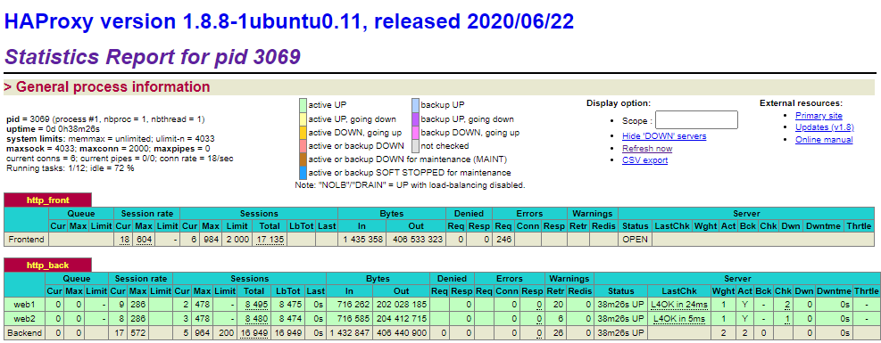
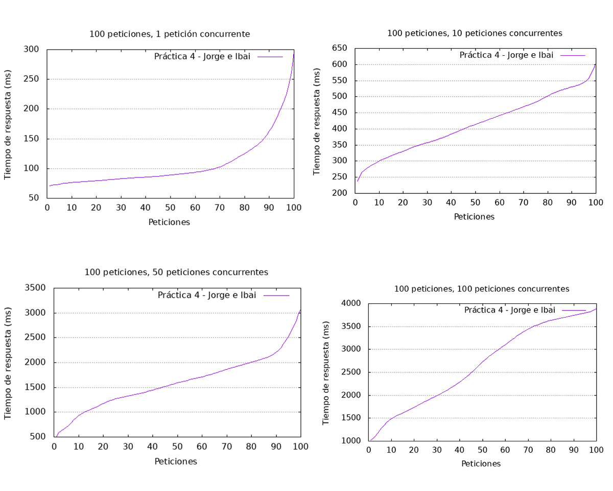
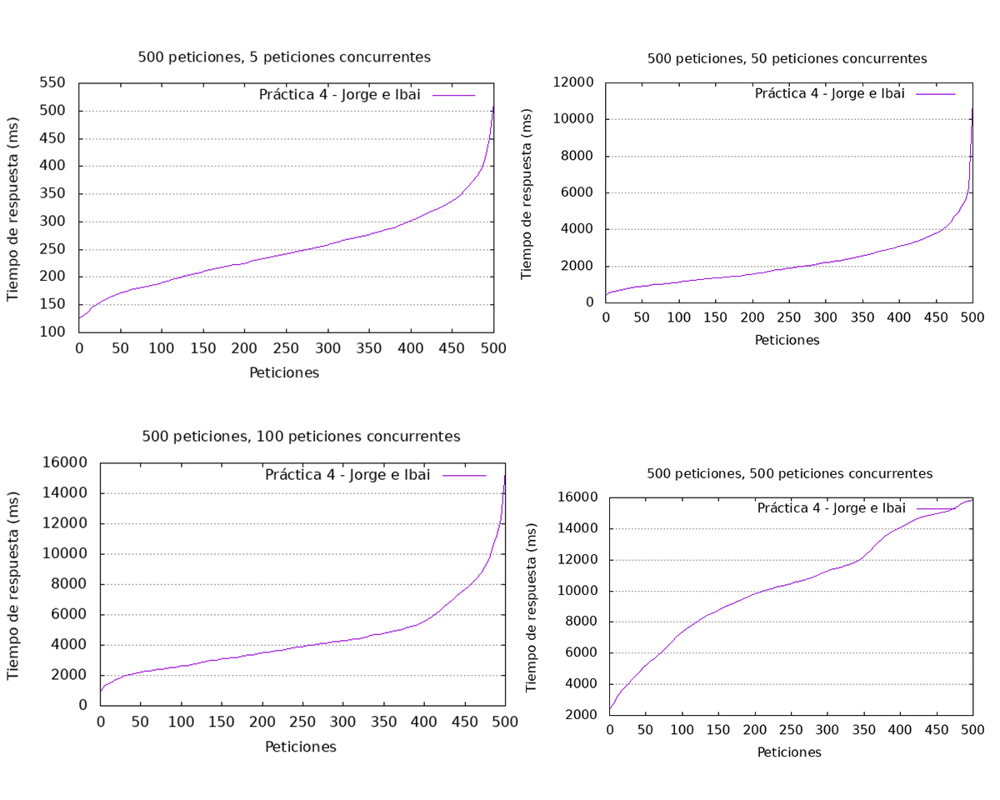
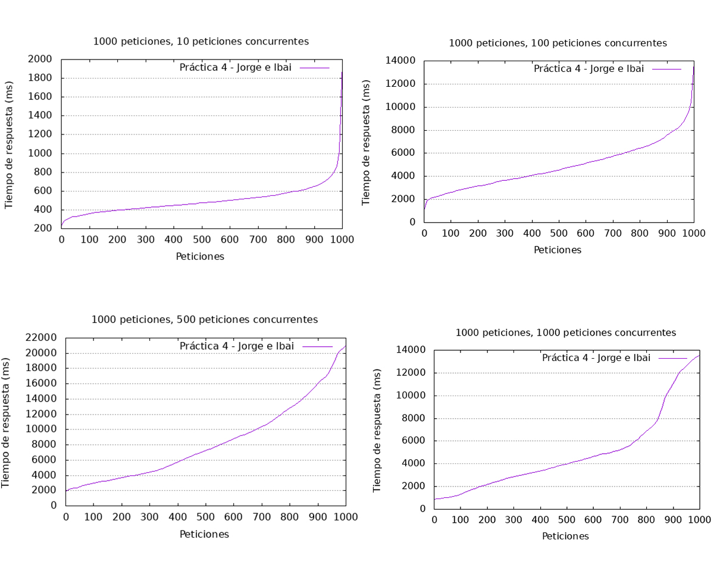
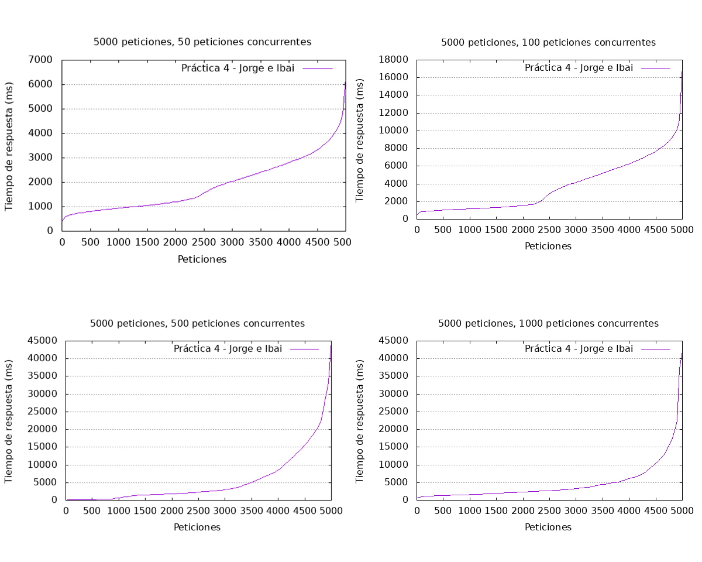

# Documentación técnica de arquitectura web con balanceo de carga y alta disponibilidad

> Jorge El Busto & Ibai Guillén
> 

> Ingeniería Informática + TDE
> 

---

# Objetivos de la práctica

Los objetivos de la práctica presentada y su ponderación son los siguientes.

- Creación de 5 VMs (web1, web2, db y lb1 y lb2) con Vagrant (35%).
- Configuración de HAProxy en las VMs lb1 y lb2 con Vagrant (20%).
- Instalación y configuración de Keepalived en las VMs lb1 y lb2 con Vagrant (35%).
- Pruebas de rendimiento (10%).
- Extras (10% como máximo).

---

# Creación de 5 máquinas virtuales con Vagrant

En esta práctica, se han de crear cinco máquinas virtuales con **Vagrant**. Dos de ellas harán referencia al blog de **Wordpress** y tendrán **Apache** instalado (*web1* y *web2*), mientras que otra servirá como base de datos y contendrá **MySQL** (*db*).

Por otra parte, en lugar de un servidor proxy, contaremos con dos que tendrán instalados tanto **Keepalived** como **HaProxy** para asegurarse de que la arquitectura web creada cuenta con balanceo de carga y alta disponibilidad.

Cómo los pasos de configuración básicos de `Vagrant` han sido mencionados en la [Documentación técnica de una aplicación web virtualizada](https://www.notion.so/Documentaci-n-t-cnica-de-una-aplicaci-n-web-virtualizada-29b035377ffc4d6d8963d0c616f0e7bb), referente a la primera práctica, su explicación será omitida durante el proceso de configuración actual.

- Configuración correspondiente a las máquinas virtuales:
    - Máquina virtual con MySQL
        - Carpeta sincronizada
            
            Para mantener la configuración y datos de la base de datos aunque la máquina sea eliminada se ha decidido crear una carpeta llamada `db-data`, para sincronizar y salvar los ficheros de `MySQL` de la máquina virtual en `/var/lib/mysql`.
            
        - Vagrantfile
            
            ```ruby
            config.vm.define :db  do |db|
                db.vm.hostname = "db"
                db.vm.network "private_network", ip: "192.168.100.99"
                db.vm.synced_folder "db-data", "/var/lib/mysql"
                db.vm.network "forwarded_port", guest: 3306, host: 3306
                db.vm.provision "shell", path: "mysql.sh"
                db.vm.provider "virtualbox" do |vb|
                  vb.memory = "1024"
                end
              end
            ```
            
        - Script de aprovisionamiento
            
            ```bash
            #!/usr/bin/env bash
            
            apt-get -y update
            apt-get -y upgrade
            
            debconf-set-selections <<< 'mysql-server mysql-server/root_password password root'	
            debconf-set-selections <<< 'mysql-server mysql-server/root_password_again password root'
            apt-get install -y mysql-server
            apt-get install -y mysql-client 
            mysql -u root --password=root -e "CREATE DATABASE wordpress;"
            mysql -u root --password=root -e "create user 'wp_user'@'%' identified by 'wp_pass';"
            mysql -u root --password=root -e "grant all on wordpress.* to 'wp_user'@'%';"
            mysql -u root --password=root -e "flush privileges;"
            sed -i "s/127.0.0.1/0.0.0.0/g" /etc/mysql/mysql.conf.d/mysqld.cnf
            service mysql restart
            ```
            
        
        ---
        
    - Máquina virtual con HAProxy Y Keepalived
        - Carpeta sincronizada
            
            Para cargar la configuración del `proxy` en la máquina virtual se ha decidido crear una carpeta llamada `proxy-config` con el fichero de configuración `haproxy.cfg`, de esta forma, copiando el archivo de configuración dentro de la máquina virtual el `proxy` quedaría configurado.
            
        - Vagrantfile
            
            ```ruby
            config.vm.define :lb1 do |lb1_config|
                    lb1_config.vm.provider :virtualbox do |vb_config|
                        vb_config.name = "lb1"
                        vb_config.memory = "512"
                    end
                    lb1_config.vm.hostname = "lb1"
            				lb1_config.vm.synced_folder "proxy-config", "/vagrant_data"
                    lb1_config.vm.network "private_network", ip: "192.168.100.100"
                    lb1_config.vm.provision "shell", path: "proxy.sh"
                end
            config.vm.define :lb2 do |lb2_config|
                    lb2_config.vm.provider :virtualbox do |vb_config|
                        vb_config.name = "lb2"
                        vb_config.memory = "512"
                    end
                    lb2_config.vm.hostname = "lb2"
                    lb2_config.vm.network "private_network", ip: "192.168.100.104"
            				lb2_config.vm.synced_folder "proxy-config", "/vagrant_data"
                    lb2_config.vm.provision "shell", path: "proxy2.sh"
                end
            ```
            
        - Script de aprovisionamiento para LB1
            
            ```bash
            #!/usr/bin/env bash
            apt-get -y update
            apt-get -y install haproxy keepalived
            cp /vagrant_data/haproxy.cfg /etc/haproxy/haproxy.cfg
            /bin/su -c "echo 'net.ipv4.ip_nonlocal_bind = 1' >> /etc/sysctl.conf"
            sysctl -p 
            touch /etc/keepalived/keepalived.conf
            echo 'global_defs {
              router_id lb1
            }
            vrrp_script haproxy {
              script "killall -0 haproxy"
              interval 2
              weight 2
            }
            vrrp_instance lb1 {
              virtual_router_id 50
              advert_int 1
              priority 101
              state MASTER
              interface enp0s8
              virtual_ipaddress {
                192.168.100.50 dev enp0s8
              }
              track_script {
                haproxy
              }
            }' >> /etc/keepalived/keepalived.conf
            service haproxy restart
            service keepalived restart
            ```
            
        - Script de aprovisionamiento para LB2
            
            ```bash
            #!/usr/bin/env bash
            apt-get -y update
            apt-get -y install haproxy keepalived
            cp /vagrant_data/haproxy.cfg /etc/haproxy/haproxy.cfg
            /bin/su -c "echo 'net.ipv4.ip_nonlocal_bind = 1' >> /etc/sysctl.conf"
            sysctl -p 
            touch /etc/keepalived/keepalived.conf
            echo 'global_defs {
              # Keepalived process identifier
              lvs_id lb2
            }
            # Script used to check if HAProxy is running
            vrrp_script check_haproxy {
              script "killall -0 haproxy"
              interval 2
              weight 2
            }
            # Virtual interface
            # The priority specifies the order in which the assigned interface to take over in a failover
            vrrp_instance lb2 {
              state SLAVE
              interface enp0s8
              virtual_router_id 50
              priority 100
              # The virtual ip address shared between the two loadbalancers
              virtual_ipaddress {
                192.168.100.50 dev enp0s8
              }
              track_script {
                check_haproxy
              }
            }' >> /etc/keepalived/keepalived.conf
            service haproxy restart
            service keepalived restart#!/usr/bin/env bash
            apt-get -y update
            apt-get -y install haproxy keepalived
            cp /vagrant_data/haproxy.cfg /etc/haproxy/haproxy.cfg
            /bin/su -c "echo 'net.ipv4.ip_nonlocal_bind = 1' >> /etc/sysctl.conf"
            sysctl -p 
            touch /etc/keepalived/keepalived.conf
            echo 'global_defs {
              router_id lb1
            }
            vrrp_script haproxy {
              script "killall -0 haproxy"
              interval 2
              weight 2
            }
            vrrp_instance lb1 {
              virtual_router_id 50
              advert_int 1
              priority 101
              state MASTER
              interface enp0s8
              virtual_ipaddress {
                192.168.100.50 dev enp0s8
              }
              track_script {
                haproxy
              }
            }' >> /etc/keepalived/keepalived.conf
            service haproxy restart
            service keepalived restart
            ```
            
        - Archivo de configuración haproxy.cfg
            
            <aside>
            💡 Se entrará en detalle más adelante.
            
            </aside>
            
            ```bash
            global
                    log /dev/log    local0
                    log /dev/log    local1 notice
                    chroot /var/lib/haproxy
                    stats socket /run/haproxy/admin.sock mode 660 level admin expose-fd listeners
                    stats timeout 30s
                    user haproxy
                    group haproxy
                    daemon
            
                    ca-base /etc/ssl/certs
                    crt-base /etc/ssl/private
            			  ssl-default-bind-ciphers ECDH+AESGCM:DH+AESGCM:ECDH+AES256:DH+AES256:ECDH+AES128:DH+AES:RSA+AESGCM:RSA+AES:!aNULL:!MD5:!DSS
                    ssl-default-bind-options no-sslv3
            
                    
            defaults
                    log     global
                    mode    http
                    option  httplog
                    option  dontlognull
                    timeout connect 5000
                    timeout client  50000
                    timeout server  50000
                    errorfile 400 /etc/haproxy/errors/400.http
                    errorfile 403 /etc/haproxy/errors/403.http
                    errorfile 408 /etc/haproxy/errors/408.http
                    errorfile 500 /etc/haproxy/errors/500.http
                    errorfile 502 /etc/haproxy/errors/502.http
                    errorfile 503 /etc/haproxy/errors/503.http
                    errorfile 504 /etc/haproxy/errors/504.http
            
            frontend http_front
                    bind *:80
                    stats uri /haproxy?stats
                    stats auth username:password
                    default_backend http_back
            
            backend http_back
                    balance roundrobin
                    server web1 192.168.100.101:80 check
                    server web2 192.168.100.102:80 check
            ```
            
        
        ---
        
    - Máquinas virtuales Wordpress
        - Carpeta sincronizada
            
            El objetivo de estas n máquinas virtuales es la de tener tantas instancias Wordpress idénticas como queramos para que nuestra aplicación soporte el mayor número de peticiones por segundo.
            
            Además, debido a la redundancia de estas máquinas virtuales se ha decidido modificar los procesos de aprovisionamiento para optimizar el tiempo, de modo que, en vez de descargarse Wordpress dentro de cada máquina virtual habrá que descargarlo con antelación y colocarlo en la carpeta compartida `web-config`.
            
            Por lo cual en la carpeta compartida deberían de encontrarse dos cosas, la carpeta `wordpress` con la descarga de `Wordpress` dentro y el fichero `wp-config.php`.
            
        - Vagrantfile
            
            <aside>
            ⚠️ La declaración de la variable debe ser antes de que empiece la configuración del `Vagrantfile`.
            
            </aside>
            
            ```bash
            $num_instances = 2
            Vagrant.configure("2") do |config|
            ...
            ```
            
            ```ruby
            (1..$num_instances).each do |i|
                config.vm.define vm_name = "%s-%02d" % ["web", i] do |web_config|
                  web_config.vm.synced_folder "web-config", "/vagrant_data"
                  host_ip = "192.168.100.#{i+100}"
                  web_config.vm.network "private_network", ip: host_ip
                  web_config.vm.provision "shell", path: "web.sh"
                  web_config.vm.provider "virtualbox" do |vb|
                    vb.memory = "1024"
                  end
                end
              end
            ```
            
            <aside>
            💡 Con este bucle podremos crear tantas máquinas `Wordpress` como queramos con el simple cambio de la variable `$num_instances`.
            
            </aside>
            
        - Script de aprovisionamiento
            
            ```bash
            #!/usr/bin/env bash
            
            apt-get -y update
            apt-get -y upgrade
            apt-get install -y apache2 php php-mysql
            rm /var/www/html/index.html
            cp -R /vagrant_data/wordpress/* /var/www/html
            cp /vagrant_data/wp-config.php /var/www/html/wp-config.php
            service apache2 restart
            ```
            
        - Fichero de configuración Wordpress wp-config.php
            
            ```php
            <?php
            
            define( 'DB_NAME', 'wordpress' );
            define( 'DB_USER', 'wp_user' );
            define( 'DB_PASSWORD', 'wp_pass' );
            define( 'DB_HOST', '192.168.100.99' );
            define( 'DB_CHARSET', 'utf8mb4' );
            define( 'DB_COLLATE', '' );
            
            define( 'AUTH_KEY',         'BT1eSP+ki=qKpIAZ%tVwM/VP?l[`~^t36|y==a=xK8^*dch;sx)VpCG/x7gN|Vp,' );
            define( 'SECURE_AUTH_KEY',  'p9G]5MB@(W#Oq_t9K$q!a$I$B0HP7JT46`E2[Wg%|NZXyCliRdDd(crCemzoQK2;' );
            define( 'LOGGED_IN_KEY',    'fW (s5a?>_/tJO^GKJN t|_85(LuI>|r_N:D[KeB ?tO^Y-5YvA!eWZ}4yT]N1@t' );
            define( 'NONCE_KEY',        ']2CV5)rC[Gar+$xW$|,$>fWe?P8 VK px{%@-S +.5a+a(U+g64=_y^SBbnN:$%K' );
            define( 'AUTH_SALT',        'sTud;r=ap4*PS#w6QUYL${?N>3#^X:Qm<g`BzE9ai69~`iSYt,Vqj)jzx&Zy(+ku' );
            define( 'SECURE_AUTH_SALT', '}~i`C[tFb)+<1xDqox,f>TLNX_/TJ~jm5J1|cMAXG@@h1i ]4dsf@QEgt>):NnY3' );
            define( 'LOGGED_IN_SALT',   ']=K~+LzaP=~0Tdr0w6q[o!;z7^TFsHj>v72ZW)D?1HjcW !)?|X[bqE,ZO5y$8~G' );
            define( 'NONCE_SALT',       '9E&zzOGw%`I|vk&prdyk $~pK[$IbOf @IXxA^BRRr5-PsM3H>N(.A6fX3w.?-B}' );
            
            $table_prefix = 'wp_';
            
            define( 'WP_DEBUG', false );
            
            if ( ! defined( 'ABSPATH' ) ) {
            	define( 'ABSPATH', __DIR__ . '/' );
            }
            
            require_once ABSPATH . 'wp-settings.php';
            ```
            
        
        ---
        

## Resultado

Resumiendo y reuniendo todo lo anteriormente mencionado se ha de recordar que la estructura de ficheros y sus contenidos sería la siguiente.

- `web-config/wordpress` tendría el contenido descargado de `Wordpress` antes de lanzar las máquinas virtuales.
- `proxy1.sh` y `proxy2.sh` serán los ficheros que contendrán los comandos necesarios para instalar HaProxy y crear los ficheros `keepalived.conf` referentes a la configuración de Keepalived en cada una de las dos máquinas virtuales encargadas del balanceo de carga.
- El fichero `haproxy.cfg` contiene la configuración necesaria para garantizar el balanceo de carga, y será referenciado con más profundidad en el apartado referente a la [configuración de HaProxy y visualización de estadísticas](https://www.notion.so/Documentaci-n-t-cnica-de-arquitectura-web-con-balanceo-de-carga-y-alta-disponibilidad-a2df669e9db24ed88d254a1d505dbeb0).

```bash
├───**Vagrantfile**
├───**mysql.sh**
├───**proxy1.sh**
├───**proxy2.sh**
├───**web.sh**
├───db-data
├───proxy-config
│   └───**haproxy.cfg**
└───web-config
    ├───*wordpress*
		│   └───**...**
		└───**web-config.php**
└───keepalived-lb1
    ├───**keepalived.conf**
└───keepalived-lb2
    ├───**keepalived.conf**
```

---

`Vagrantfile`

```ruby
$num_instances = 2
Vagrant.configure("2") do |config|
  config.vm.box = "ubuntu/bionic64"
  
  config.vm.define :db  do |db|
    db.vm.hostname = "db"
    db.vm.network "private_network", ip: "192.168.100.99"
   # db.vm.synced_folder "db-data", "/var/lib/mysql"
    db.vm.network "forwarded_port", guest: 3306, host: 3306
    db.vm.provision "shell", path: "mysql.sh"
    db.vm.provider "virtualbox" do |vb|
      vb.memory = "1024"
    end
  end
  (1..$num_instances).each do |i|
    config.vm.define vm_name = "%s-%02d" % ["web", i] do |web_config|
      web_config.vm.synced_folder "web-config", "/vagrant_data"
      host_ip = "192.168.100.#{i+100}"
      web_config.vm.network "private_network", ip: host_ip
      web_config.vm.provision "shell", path: "web.sh"
      web_config.vm.provider "virtualbox" do |vb|
        vb.memory = "1024"
      end
    end
  end
  config.vm.define :lb1 do |lb1_config|
        lb1_config.vm.provider :virtualbox do |vb_config|
            vb_config.name = "lb1"
            vb_config.memory = "512"
        end
        lb1_config.vm.hostname = "lb1"
				lb1_config.vm.synced_folder "proxy-config", "/vagrant_data"
        lb1_config.vm.network "private_network", ip: "192.168.100.100"
        lb1_config.vm.provision "shell", path: "proxy.sh"
    end
    config.vm.define :lb2 do |lb2_config|
        lb2_config.vm.provider :virtualbox do |vb_config|
            vb_config.name = "lb2"
            vb_config.memory = "512"
        end
        lb2_config.vm.hostname = "lb2"
        lb2_config.vm.network "private_network", ip: "192.168.100.104"
				lb2_config.vm.synced_folder "proxy-config", "/vagrant_data"
        lb2_config.vm.provision "shell", path: "proxy2.sh"
    end
end
```

---

`mysql.sh`

```bash
#!/usr/bin/env bash

apt-get -y update
apt-get -y upgrade
debconf-set-selections <<< 'mysql-server mysql-server/root_password password root'	
debconf-set-selections <<< 'mysql-server mysql-server/root_password_again password root'
apt-get install -y mysql-server
apt-get install -y mysql-client 
mysql -u root --password=root -e "CREATE DATABASE wordpress;"
mysql -u root --password=root -e "create user 'wp_user'@'%' identified by 'wp_pass';"
mysql -u root --password=root -e "grant all on wordpress.* to 'wp_user'@'%';"
mysql -u root --password=root -e "flush privileges;"
sed -i "s/127.0.0.1/0.0.0.0/g" /etc/mysql/mysql.conf.d/mysqld.cnf
service mysql restart`proxy.sh`
```

---

`proxy1.sh` y `proxy2.sh`

```bash
apt-get -y update
apt-get -y install haproxy keepalived
cp /vagrant_data/haproxy.cfg /etc/haproxy/haproxy.cfg
/bin/su -c "echo 'net.ipv4.ip_nonlocal_bind = 1' >> /etc/sysctl.conf"
sysctl -p 
touch /etc/keepalived/keepalived.conf
echo 'contenido del keepalived.conf' >> /etc/keepalived/keepalived.conf
#Dicho contenido se sustituirá por scripts que serán observados más en adelante,
#en la sección dedicada a Keepalived.
service haproxy restart
service keepalived restart
```

---

`web.sh`

```bash
#!/usr/bin/env bash

apt-get -y update
apt-get -y upgrade
apt-get install -y apache2 php php-mysql
rm /var/www/html/index.html
cp -R /vagrant_data/wordpress/* /var/www/html
cp /vagrant_data/wp-config.php /var/www/html/wp-config.php
service apache2 restart
```

---

`haproxy.cfg`

```bash
global
        log /dev/log    local0
        log /dev/log    local1 notice
        chroot /var/lib/haproxy
        stats socket /run/haproxy/admin.sock mode 660 level admin expose-fd listeners
        stats timeout 30s
        user haproxy
        group haproxy
        daemon
        ca-base /etc/ssl/certs
        crt-base /etc/ssl/private
        ssl-default-bind-ciphers ECDH+AESGCM:DH+AESGCM:ECDH+AES256:DH+AES256:ECDH+AES128:DH+AES:RSA+AESGCM:RSA+AES:!aNULL:!MD5:!DSS
        ssl-default-bind-options no-sslv3

defaults
        log     global
        mode    http
        option  httplog
        option  dontlognull
        timeout connect 5000
        timeout client  50000
        timeout server  50000
        errorfile 400 /etc/haproxy/errors/400.http
        errorfile 403 /etc/haproxy/errors/403.http
        errorfile 408 /etc/haproxy/errors/408.http
        errorfile 500 /etc/haproxy/errors/500.http
        errorfile 502 /etc/haproxy/errors/502.http
        errorfile 503 /etc/haproxy/errors/503.http
        errorfile 504 /etc/haproxy/errors/504.http

frontend http_front
        bind *:80
        stats uri /haproxy?stats
        stats auth username:password
        default_backend http_back

backend http_back
        balance roundrobin
        server web1 192.168.100.101:80 check
        server web2 192.168.100.102:80 check
```

---

`keepalived.conf` para **LB1**

```bash
global_defs {
  router_id lb1
}
vrrp_script haproxy {
  script "killall -0 haproxy"
  interval 2
  weight 2
}
vrrp_instance lb1 {
  virtual_router_id 50
  advert_int 1
  priority 101
  state MASTER
  interface enp0s8
  virtual_ipaddress {
    192.168.100.50 dev enp0s8
  }
  track_script {
    haproxy
  }
}
```

---

`keepalived.conf` para **LB2**

```bash
global_defs {
  lvs_id lb2
}
vrrp_script check_haproxy {
  script "killall -0 haproxy"
  interval 2
  weight 2
}
vrrp_instance lb2 {
  state SLAVE
  interface enp0s8
  virtual_router_id 50
  priority 100
  virtual_ipaddress {
    192.168.100.50 dev enp0s8
  }
  track_script {
    check_haproxy
  }
}
```

---

`wp-config.php`

```php
<?php

define( 'DB_NAME', 'wordpress' );
define( 'DB_USER', 'wp_user' );
define( 'DB_PASSWORD', 'wp_pass' );
define( 'DB_HOST', '192.168.100.99' );
define( 'DB_CHARSET', 'utf8mb4' );
define( 'DB_COLLATE', '' );

define( 'AUTH_KEY',         'BT1eSP+ki=qKpIAZ%tVwM/VP?l[`~^t36|y==a=xK8^*dch;sx)VpCG/x7gN|Vp,' );
define( 'SECURE_AUTH_KEY',  'p9G]5MB@(W#Oq_t9K$q!a$I$B0HP7JT46`E2[Wg%|NZXyCliRdDd(crCemzoQK2;' );
define( 'LOGGED_IN_KEY',    'fW (s5a?>_/tJO^GKJN t|_85(LuI>|r_N:D[KeB ?tO^Y-5YvA!eWZ}4yT]N1@t' );
define( 'NONCE_KEY',        ']2CV5)rC[Gar+$xW$|,$>fWe?P8 VK px{%@-S +.5a+a(U+g64=_y^SBbnN:$%K' );
define( 'AUTH_SALT',        'sTud;r=ap4*PS#w6QUYL${?N>3#^X:Qm<g`BzE9ai69~`iSYt,Vqj)jzx&Zy(+ku' );
define( 'SECURE_AUTH_SALT', '}~i`C[tFb)+<1xDqox,f>TLNX_/TJ~jm5J1|cMAXG@@h1i ]4dsf@QEgt>):NnY3' );
define( 'LOGGED_IN_SALT',   ']=K~+LzaP=~0Tdr0w6q[o!;z7^TFsHj>v72ZW)D?1HjcW !)?|X[bqE,ZO5y$8~G' );
define( 'NONCE_SALT',       '9E&zzOGw%`I|vk&prdyk $~pK[$IbOf @IXxA^BRRr5-PsM3H>N(.A6fX3w.?-B}' );

$table_prefix = 'wp_';

define( 'WP_DEBUG', false );
if ( ! defined( 'ABSPATH' ) ) {
	define( 'ABSPATH', __DIR__ . '/' );
}
require_once ABSPATH . 'wp-settings.php';
```

## Configuración de HAProxy y visualización de estadísticas

El archivo haproxy.cfg es el fichero de configuración del software proxy que se va a utilizar. Como se ha mencionado en la creación de las máquinas, el contenido de este fichero debe ser el siguiente:

```bash
global
        log /dev/log    local0
        log /dev/log    local1 notice
        chroot /var/lib/haproxy
        stats socket /run/haproxy/admin.sock mode 660 level admin expose-fd listeners
        stats timeout 30s
        user haproxy
        group haproxy
        daemon
        ca-base /etc/ssl/certs
        crt-base /etc/ssl/private
        ssl-default-bind-ciphers ECDH+AESGCM:DH+AESGCM:ECDH+AES256:DH+AES256:ECDH+AES128:DH+AES:RSA+AESGCM:RSA+AES:!aNULL:!MD5:!DSS
        ssl-default-bind-options no-sslv3
    
defaults
        log     global
        mode    http
        option  httplog
        option  dontlognull
        timeout connect 5000
        timeout client  50000
        timeout server  50000
        errorfile 400 /etc/haproxy/errors/400.http
        errorfile 403 /etc/haproxy/errors/403.http
        errorfile 408 /etc/haproxy/errors/408.http
        errorfile 500 /etc/haproxy/errors/500.http
        errorfile 502 /etc/haproxy/errors/502.http
        errorfile 503 /etc/haproxy/errors/503.http
        errorfile 504 /etc/haproxy/errors/504.http

frontend http_front
        bind *:80
        stats uri /haproxy?stats
        stats auth username:password
        default_backend http_back

backend http_back
        balance roundrobin
        server web1 192.168.100.101:80 check
        server web2 192.168.100.102:80 check
```

Este fichero solo contiene dos modificaciones respecto del archivo de configuración inicial, los apartados `frontend` y `backend`.

- En el apartado `frontend` se define el puerto de escucha, la url de consulta de las estadísticas, usuario y contraseña para acceder a las estadísticas y el servicio backend por defecto.
- En el apartado `backend` se define el algoritmo de balanceo de carga y los servidores web que van a participar en este balanceo.

Accediendo a la URL de las estadísticas (192.168.100.50/haproxy?stats) y entrando con el nombre de usuario **username** y la contraseña **password,** podremos ver un panel como el siguiente.

<aside>
⚠️ **192.168.100.50** es la IP virtual que comparten las dos máquinas encargadas del balanceo de carga.

</aside>



<aside>
💡 El portal nos ofrece la posibilidad de exportar la información a *csv* para analizarla con alguna otra herramienta.

</aside>

# Instalación y configuración de Keepalived

## ¿Qué es Keepalived?

Como bien se ha podido apreciar previamente, la diferencia de esta práctica respecto a la anterior radica en que esta vez se configuran dos máquinas virtuales que harán de proxy... ¿pero por qué?

En esta práctica se recurre a **Keepalived**, un software de enrutamiento que se encarga de mandar pulsaciones entre un servidor y otro para favorecer la alta disponibilidad mediante un esquema activo-pasivo.

Se contará con un servidor activo (en este caso, *lb1*), y en caso de que este se caiga, será el pasivo (*lb2*) el que tome el control del proxy. En esta práctica, el paso que se dará es la correcta configuración del protocolo VRRP a través del cual los servidores proxy se enviarán pulsaciones para comprobar su disponibilidad.

## Configurando Keepalived

Para configurar Keepalived, procedemos a realizar el siguiente paso en el proceso de aprovisionamiento de las máquinas virtuales de balanceo de carga.

```bash
apt-get -y update
apt-get -y install haproxy keepalived
cp /vagrant_data/haproxy.cfg /etc/haproxy/haproxy.cfg
/bin/su -c "echo 'net.ipv4.ip_nonlocal_bind = 1' >> /etc/sysctl.conf"
sysctl -p 
touch /etc/keepalived/keepalived.conf
echo "Aquí varía en función de qué máquina virtual LB sea" >> keepalived.conf
service haproxy restart
service keepalived restart
```

<aside>
ℹ️ La cuarta línea de este fichero se añade al final del fichero `sysctl.conf` para que *lb1* y *lb2* puedan compartir una dirección IP virtual, y habilita la pila TCP/IPV4 para que ésta pueda responder ante una IP que no figura en ninguna interfaz de red. La quinta línea, simplemente, guarda los cambios.

</aside>

Por otra parte, se han creado dos ficheros `keepalived.conf` designando la dirección IP que van a compartir los dos balanceadores de carga, y configurando el protocolo VRRP. Cada uno de los ficheros va asociado a una máquina virtual.

Cabe destacar que se ha optado por los comandos `touch` y `echo` para crear los ficheros "keepalived.conf", debido a conflictos otorgando permisos al nuevo fichero en cuestión si se utilizaba el `config.vm.synced_folder` de Vagrant.

A continuación, se adjuntan los dos ficheros *keepalived.conf*, cada uno correspondiente a una máquina virtual.

```bash
#---------------------------------------LB1---------------------------------------
global_defs {
  router_id lb1
}
vrrp_script haproxy {
  script "killall -0 haproxy"
  interval 2
  weight 2
}
vrrp_instance lb1 {
  virtual_router_id 50
  advert_int 1
  priority 101
  state MASTER
  interface enp0s8 #Aquí especificamos la interfaz en la que actuará Keepalived.
#La interfaz difiere según el dispositivo.
  virtual_ipaddress {
    192.168.100.50 dev enp0s8
  }
  track_script {
    haproxy
  }
}
```

```bash
#---------------------------------------LB2---------------------------------------
global_defs {
  lvs_id lb2
}
vrrp_script check_haproxy {
  script "killall -0 haproxy"
  interval 2
  weight 2
}
vrrp_instance lb2 {
  state SLAVE
  interface enp0s8 #Aquí especificamos la interfaz en la que actuará Keepalived.
#La interfaz difiere según el dispositivo.
  virtual_router_id 50
  priority 100
  virtual_ipaddress {
    192.168.100.50 dev enp0s8
  }
  track_script {
    check_haproxy
  }
}
```

---

Una vez iniciadas las máquinas virtuales de Vagrant, se ha de comprobar que ambas máquinas virtuales encargadas del balanceo de carga se comunican adecuadamente mediante el protocolo VRRP, algo que se realizará de la siguiente manera:

- Conexión a ambas máquinas mediante `vagrant ssh`.
- Ejecutar el comando `tail -f /var/log/syslog` para comprobar lo que va sucediendo en *lb2.*
- Detener HaProxy en *lb1* mediante el comando `service haproxy stop` y ver lo que sucede.


Efectivamente, si se detiene HaProxy, la máquina virtual *lb2* pasa a tener el control del servidor, y entra en el estado **MASTER**. Si se relanza HaProxy en *lb1*, *lb2* volverá automáticamente a entrar en su característico estado **BACKUP**.


Una vez esté configurado **Keepalived**, será necesario cerciorarse de que todo está en orden, y que el balanceo de carga sigue realizándose de forma óptima. Para ello, se ha realizado el proceso de configuración de **Wordpress** en la dirección IP `192.168.100.101` , se ha modificado una entrada desde `192.168.100.102` , y se ha accedido a ella desde la dirección IP que comparten ambos proxys, `192.168.100.50`. Y, efectivamente, funciona desde las tres.


---

# Pruebas de rendimiento

## Elaborando los scripts con ApacheBench y GNUPlot

Para realizar las pruebas de rendimiento pertinentes, siguiendo el procedimiento empleado en las dos prácticas anteriores, se ha utilizado **ApacheBench**, un programa provisto por Apache que permite realizar un análisis exhaustivo del rendimiento de servidores HTTP. 

Para lograr extraer los ficheros a raíz de los cuales se elaborarán los gráficos analizando los resultados obtenidos, se ha de crear un fichero ejecutable de Linux, `test.sh`.  En este fichero se especificarán el número de peticiones a realizar, y destacan los *flags* `-c` y `-n`. El primero indica el número de peticiones concurrentes que se realizarán, y el segundo indica a secas el número de peticiones a realizar. 

Además, se utiliza el *flag* `-g` y se pasa como parámetro el fichero de valores separado por tabuladores al que queremos exportar los datos. De esta manera, habrá salidas en ficheros tanto *tsv* como *log*, para luego poder elegir los datos relevantes para elaborar los gráficos con más comodidad. 

La dirección IP a probar es la `192.168.100.50`, que es la que comparten ambos proxys mediante Keepalived.

```bash
#!/bin/bash 
	 for N in 100 500 1000 5000 10000
	 do
		for C in 1 5 10 50 100 500 1000
		do
			echo "Testing -n $N -c $C..."
			ab -g pr4test-$N-$C.tsv -n $N -c $C http://192.168.100.50/ &> pr4test-$N-$C.log
		done
	done
```

Respecto a la elaboración de gráficos, siguiendo el procedimiento realizado en la práctica anterior, se ha optado por una forma diferente de elaborarlos, aprovechando una herramienta disponible en Linux como es **Gnuplot**. Se ha creado un fichero `ab-result.plot`, que generará un gráfico con los valores que haya en el fichero `.tsv` generado previamente por ApacheBench. 

```bash
set terminal png size 600
set output "graph100-1.png"
set title "100 peticiones, 1 petición concurrente"
set size ratio 0.6
set grid y
set xlabel "Peticiones"
set ylabel "Tiempo de respuesta (ms)"
plot "pr4test-100-1.tsv" using 9 smooth sbezier with lines title "Práctica 4 - Jorge e Ibai"
exit
```

Después, se ejecuta el comando `sudo gnuplot ab-result.plot` para sacar, vía Gnuplot, los resultados a un fichero de imagen. 

---

## Análisis de resultados

### 100 peticiones



Como podemos observar a simple vista los resultados de las pruebas de rendimiento con keepalived dan mejores resultados que el balanceo de carga sin esta herramienta. Aún así los tiempos de carga suben muy por encima de los que podría darse de haber utilizado contenedores.

En vista a los resultados obtenidos podemos ver como a partir de la primera prueba los tiempos de espera suben sin parar y no se estabilizan. Los únicos resultados aceptables para una página web serían los de 10 peticiones concurrentes o menos con 100 peticiones. A partir de esta carga los tiempos de espera suben por encima del segundo y sería inutilizable. 

---

### 500 peticiones



Con 500 peticiones podríamos decir que la única carga aceptable para una página web abierta al público es la de 5 peticiones concurrentes que se mantiene por debajo de los 600ms de tiempo de respuesta, todo lo que suba de ahí sería inutilizable.

---

### 1.000 peticiones



Con 1.000 peticiones al igual que en el caso anterior el único caso tolerable para una página web sería el primero, que logra mantener por debajo de los 600ms el 80% de las peticiones, aun habiendo un 20% que se desvía por tiempos de respuesta elevados.

---

### 5.000 peticiones



Podría decirse que keepalived no es suficiente para llegar a dar servicio a 5.000 peticiones de ninguna de las formas posibles, puesto que todas las pruebas realizadas con esta cantidad de carga dan tiempos de respuesta por encima del segundo.

Como hemos mencionado antes, la plataforma sobre la que están corriendo estos componentes influye bastante en los resultados, Vagrant es una herramienta muy demandante de recursos para el funcionamiento de sus máquinas virtuales, para dar soporte a mayor cantidad de huéspedes se debería pensar por otra solución más óptima, que demande menos memoria y que de mejores resultados. 

En la práctica anterior se hizo el balanceo de carga con Vagrant y con Docker y se pudo ver como Docker daba muchos mejores resultados que Vagrant con menos recursos. Por eso hemos pensado que de realizar esta práctica con Docker se podrían obtener mejores resultados con los mismos recursos puesto que nos permitirían generar más contenedores entre los que balancear la carga.

---

# Extra

- Por último, como se ha podido ver a lo largo de esta documentación, se le ha aplicado un tiempo mayor que el necesario, nos hemos tomado la molestia de hacer una documentación muy detallada, muy dinámica y sobre todo, muy profesional.
    
    Por eso hemos realizado la documentación en [Notion](http://www.notion.so), una herramienta que nos permite crear la documentación en su portal web y exportarlo a *markdown*, formato estandarizado en las wikis de GitHub. Además, permite generar un link de acceso a lectura público o exportar la documentación a HTML en caso de querer publicarla online.
    
    [Notion - The all-in-one workspace for your notes, tasks, wikis, and databases.](http://www.notion.so)
    
    ---
